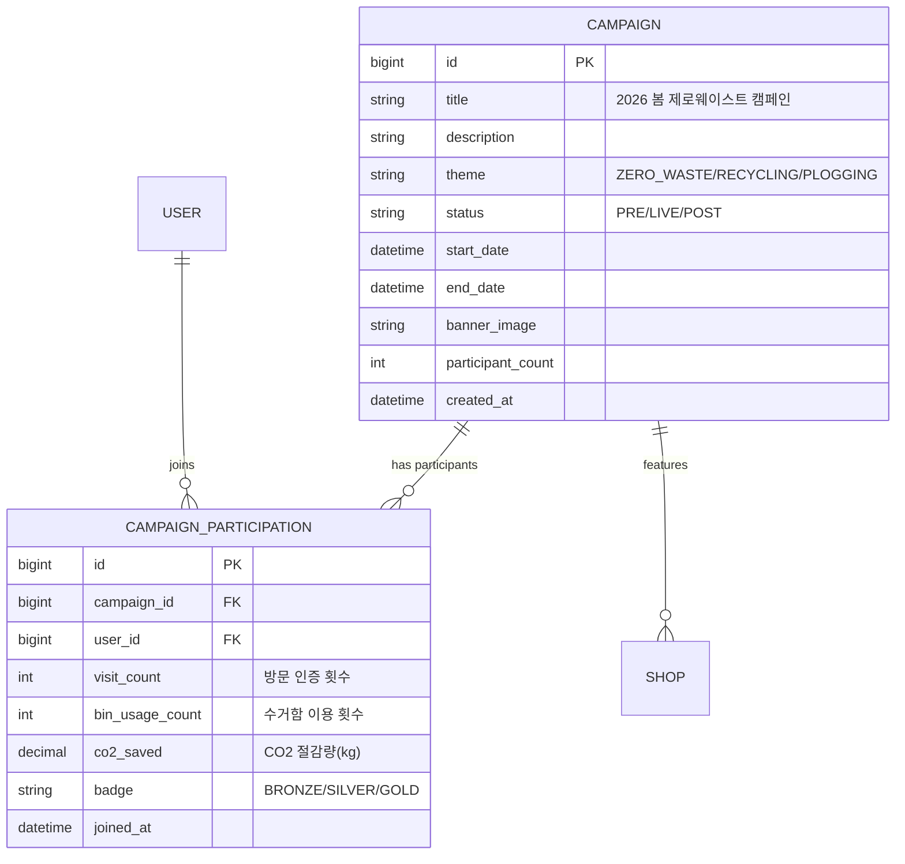

# 🔄 PRE / LIVE / POST 3단계 컨셉 적용 방안

> **참고**: IBM 원본 프로젝트의 포럼 전(PRE) / 중(LIVE) / 후(POST) 메뉴 구조를 ESG 제로 웨이스트 프로젝트에 적용

---

## 📸 IBM 원본 참고 (포럼 3단계 구조)

````carousel

<!-- slide -->

<!-- slide -->

````

### IBM 원본의 핵심 패턴

| 단계 | 핵심 변화 | 설명 |
|------|---------|------|
| **PRE** | 예고 모드 | 프로그램 소개, 연사 미리보기, 추천 세션 (일부 메뉴 비활성) |
| **LIVE** | 실시간 모드 | 현재 Live 세션, 인포그래픽, 실시간 참여 (모든 메뉴 활성) |
| **POST** | 아카이브 모드 | 올해 콘텐츠 → 지난 포럼으로 이동, 일부 메뉴 닫힘 |

---

## 💡 제로 웨이스트 프로젝트에 적용 가능한가?

### ✅ 결론: **충분히 가능합니다!**

제로 웨이스트샵 자체는 상시 서비스이지만, **ESG 캠페인/이벤트**라는 시간축을 추가하면 자연스럽게 PRE/LIVE/POST 구조가 적용됩니다.

---

## 🎯 적용 안 비교

### 안 A: ESG 캠페인 중심

> "월별/분기별 ESG 캠페인을 중심으로 3단계 전환"

```
예시: "2026 봄맞이 제로 웨이스트 캠페인"

PRE (캠페인 전)     →  LIVE (캠페인 중)      →  POST (캠페인 후)
3월 1일~14일         3월 15일~4월 15일         4월 16일~
```

### 안 B: 계절별 환경 캠페인

> "계절마다 다른 환경 테마 캠페인 운영"

```
🌸 봄: 플로깅 캠페인      → 🌊 여름: 해양쓰레기 줄이기
🍂 가을: 의류 수거 캠페인  → ❄️ 겨울: 에너지 절약 챌린지
```

### 안 C: 상시 서비스 + 이벤트 하이브리드 (⭐ 추천)

> "지도는 항상 사용 가능하고, 캠페인 상태에 따라 Home과 메뉴가 변화"

```
┌─────────────────────────────────────────────────┐
│  상시 서비스 (항상 활성)                           │
│  ├── 🗺️ 제로 웨이스트샵 지도                     │
│  ├── 🗑️ 수거함 지도                              │
│  ├── 🔍 검색 & 필터                              │
│  └── 👤 마이페이지                               │
│                                                 │
│  + 시간 기반 캠페인 레이어 (PRE/LIVE/POST)        │
│    ├── 🟡 PRE: 캠페인 예고 배너 + 참가 신청       │
│    ├── 🟢 LIVE: 참여 현황 실시간 + 인포그래픽     │
│    └── 🔴 POST: 결과 리포트 + 지난 캠페인 아카이브│
└─────────────────────────────────────────────────┘
```

---

## 📋 안 C (추천안) 상세 설계

### 🏠 Home 화면 변화 (3단계)

#### 🟡 PRE (캠페인 시작 전)

| 영역 | 구성 요소 |
|------|----------|
| **히어로 배너** | "🌿 2026 봄 제로 웨이스트 캠페인 D-7" 카운트다운 |
| **캠페인 소개** | 이번 캠페인 테마, 참여 방법, 참여 매장 목록 |
| **참가 신청** | 캠페인 참가 신청 버튼 (로그인 필요) |
| **참여 매장 미리보기** | 캠페인 참여 제로 웨이스트샵 하이라이트 지도 |
| **지난 캠페인** | 이전 캠페인 결과 카드 (아카이브) |
| **상시 지도** | ✅ 항상 접근 가능 |

#### 🟢 LIVE (캠페인 진행 중)

| 영역 | 구성 요소 |
|------|----------|
| **히어로 배너** | "🔥 캠페인 진행 중! 현재 523명 참여 중" 실시간 카운터 |
| **실시간 현황** | 오늘의 방문 인증 수, 수거함 이용 수 (실시간 업데이트) |
| **인포그래픽** | 참여율 차트, 지역별 참여 현황, 랭킹 |
| **오늘의 추천 매장** | 캠페인 참여 매장 하이라이트 |
| **나의 참여 현황** | 내 방문 인증 현황, 목표 달성률 Progress Bar |
| **상시 지도** | ✅ 항상 접근 가능 (캠페인 매장 강조 표시) |

#### 🔴 POST (캠페인 종료 후)

| 영역 | 구성 요소 |
|------|----------|
| **결과 배너** | "🎉 캠페인 종료! 총 1,247명 참여, CO₂ 3.2톤 절감" |
| **결과 리포트** | 전체 참여 통계, 우수 참여자 발표, 지역별 순위 |
| **나의 결과** | 개인 ESG 점수, 획득 뱃지, 참여 인증서 다운로드 |
| **지난 캠페인 아카이브** | 이전 캠페인들 목록 (접힌 상태로 보관) |
| **다음 캠페인 예고** | 다음 캠페인 티저 (자연스럽게 PRE로 전환) |
| **상시 지도** | ✅ 항상 접근 가능 |

---

### 🗂️ 메뉴 구조 변화 (IBM 방식 적용)

```
                     PRE             LIVE            POST
                 ┌──────────┬──────────────┬──────────────┐
 지도 탐색        │  ✅ 활성   │   ✅ 활성     │   ✅ 활성     │
 검색/필터        │  ✅ 활성   │   ✅ 활성     │   ✅ 활성     │
 매장 상세        │  ✅ 활성   │   ✅ 활성     │   ✅ 활성     │
─────────────────┼──────────┼──────────────┼──────────────┤
 캠페인 소개      │  ✅ 강조   │   ✅ 활성     │   ⬜ 축소     │
 참가 신청        │  ✅ 활성   │   ⬜ 마감     │   ⬜ 비활성   │
 실시간 현황      │  ⬜ 비활성 │   ✅ 강조     │   ⬜ 비활성   │
 인포그래픽       │  ⬜ 비활성 │   ✅ 강조     │   ✅ 결과용   │
 결과 리포트      │  ⬜ 비활성 │   ⬜ 비활성   │   ✅ 강조     │
 지난 캠페인      │  ✅ 활성   │   ✅ 활성     │   ✅ 강조     │
─────────────────┼──────────┼──────────────┼──────────────┤
 마이페이지       │  ✅ 활성   │   ✅ 활성     │   ✅ 활성     │
 관리자           │  ✅ 활성   │   ✅ 활성     │   ✅ 활성     │
                 └──────────┴──────────────┴──────────────┘
```

---

### 🗃️ ERD 추가 (캠페인 관련 테이블)

기존 ERD에 **2개 테이블**을 추가하면 됩니다:



---

### 🔑 기술적 구현 포인트

| 항목 | 구현 방법 |
|------|---------|
| **상태 전환** | `Campaign.status` 필드 (`PRE` → `LIVE` → `POST`) — 관리자 수동 전환 or 날짜 기반 자동 전환 |
| **Home 화면 분기** | React에서 `campaignStatus`에 따라 조건부 렌더링 |
| **지도 마커 변화** | LIVE 중에는 캠페인 참여 매장을 특별 마커(⭐)로 강조 |
| **인포그래픽** | LIVE 중 실시간 → HTTP 폴링(30초 간격) or SSE, POST에서는 최종 결과 정적 차트 |
| **실시간 카운터** | LIVE 중 참여자 수, 방문 인증 수 — Redis 캐시 활용 추천 |

```jsx
// React에서의 상태 기반 Home 렌더링 예시
function HomePage({ campaign }) {
  switch (campaign.status) {
    case 'PRE':
      return <PreCampaignHome campaign={campaign} />;
    case 'LIVE':
      return <LiveCampaignHome campaign={campaign} />;
    case 'POST':
      return <PostCampaignHome campaign={campaign} />;
    default:
      return <DefaultHome />;  // 캠페인 없을 때
  }
}
```

---

### 📊 이 컨셉의 장점

| 장점 | 설명 |
|------|------|
| **IBM 과제 부합도 ↑** | 원본 프로젝트의 PRE/LIVE/POST 패턴을 충실히 재해석 |
| **발표 어필 ↑** | "같은 서비스가 시간에 따라 다르게 동작합니다" → 데모 임팩트 큼 |
| **기술 난이도 적절** | 조건부 렌더링 + 상태 필드 → 기본적인 분기 로직으로 구현 가능 |
| **ESG 가치 ↑** | 캠페인을 통한 사용자 참여 유도 → 단순 정보 조회 서비스에서 **참여형 플랫폼**으로 격상 |
| **포트폴리오 차별화** | 정적 CRUD를 넘어 **시간 기반 상태 관리**라는 설계 역량을 보여줌 |

### ⚠️ 주의할 점

| 주의 | 대응 |
|------|------|
| 복잡도 증가 | 캠페인은 1개만 활성화되는 구조로 단순화 |
| 데모 시 상태 전환 | 관리자 페이지에서 수동으로 PRE→LIVE→POST 전환 버튼 구현 (발표용) |
| 상시 기능과 캠페인의 경계 | 지도/검색은 **항상** 작동, 캠페인은 **추가 레이어**로 명확히 분리 |

> [!IMPORTANT]
> **핵심 원칙**: 지도 서비스(상시)가 **기반**이고, 캠페인(PRE/LIVE/POST)은 **위에 얹어지는 레이어**입니다.  
> 캠페인이 없어도 서비스는 정상 동작해야 합니다. IBM 원본에서 "포럼 전에도 세션 정보를 볼 수 있도록 함"과 같은 원칙입니다.
