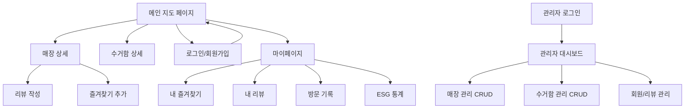
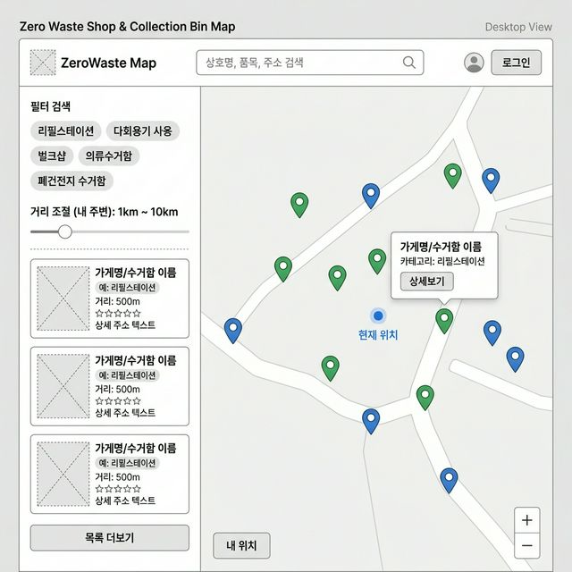
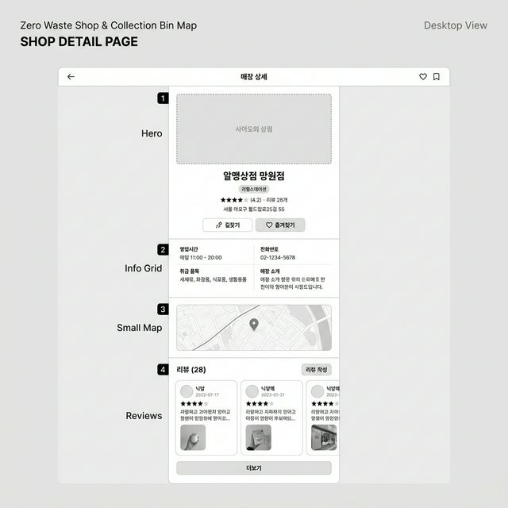
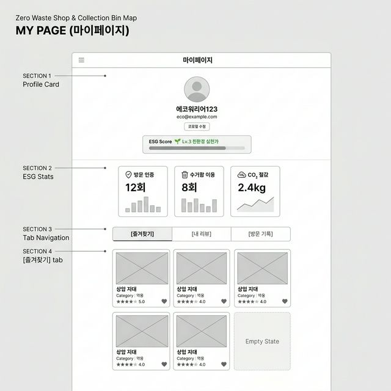
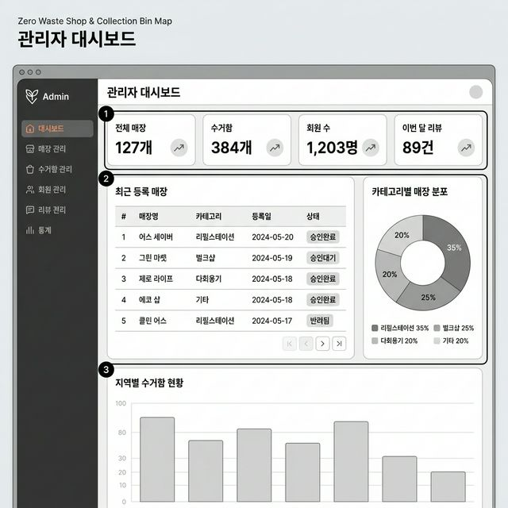

# 🖼️ ESG 제로 웨이스트샵 & 수거함 지도 — 와이어프레임 가이드

> **작성일**: 2026년 3월 24일  
> **총 화면 수**: 주요 4개 화면 (추가 화면은 하단 참고)

---

## 📱 화면 구성 전체 흐름



---

## 1️⃣ 메인 지도 페이지 (핵심 화면)



### 📐 레이아웃 구성

| 영역 | 구성 요소 | 설명 |
|------|----------|------|
| **상단 네비게이션** | 로고 + 검색바 + 로그인 버튼 | 상호명, 품목, 주소로 검색 가능 |
| **좌측 사이드바 (30%)** | 필터 + 매장/수거함 리스트 | 카테고리 칩 필터, 거리 슬라이더 |
| **우측 지도 (70%)** | 카카오맵/네이버맵 | 매장(🟢), 수거함(🔵) 마커 구분 |

### 🔑 핵심 인터랙션

1. **카테고리 칩 클릭** → 해당 카테고리만 지도에 표시 (토글 방식)
2. **거리 슬라이더** → 내 위치 기준 반경 조절
3. **마커 클릭** → 팝업 카드 표시 → "상세보기" 클릭 시 상세 페이지 이동
4. **리스트 카드 클릭** → 지도에서 해당 위치로 이동 + 마커 하이라이트
5. **"내 위치" 버튼** → 현재 GPS 위치로 지도 중심 이동

### 💡 구현 포인트

```
필터 카테고리 (칩 버튼):
├── 제로 웨이스트샵
│   ├── 리필스테이션
│   ├── 다회용기
│   └── 벌크샵
│
└── 수거함
    ├── 의류수거함
    ├── 폐건전지 수거함
    └── 폐형광등 수거함
```

---

## 2️⃣ 매장 상세 페이지



### 📐 레이아웃 구성 (4개 섹션)

| 섹션 | 구성 요소 | 설명 |
|------|----------|------|
| **① Hero** | 매장 사진, 이름, 카테고리, 별점, 주소 | 시각적 임팩트 + 핵심 정보 |
| **② Info Grid** | 영업시간, 전화번호, 취급 품목, 매장 소개 | 2열 그리드 레이아웃 |
| **③ Small Map** | 미니맵 (매장 위치 1개 마커) | 길찾기 연동 가능 |
| **④ Reviews** | 리뷰 목록 + 작성 버튼 | 사진 포함 리뷰, 별점 |

### 🔑 핵심 인터랙션

1. **❤️ 즐겨찾기** → 하트 아이콘 토글 (API: `POST/DELETE /api/favorites`)
2. **📍 길찾기** → 카카오맵/네이버맵 앱 연동 (딥링크)
3. **⭐ 리뷰 작성** → 별점(1~5) + 텍스트 + 사진 업로드 폼
4. **🔙 뒤로가기** → 지도 페이지로 복귀 (이전 필터 상태 유지)

---

## 3️⃣ 마이페이지



### 📐 레이아웃 구성 (4개 섹션)

| 섹션 | 구성 요소 | 설명 |
|------|----------|------|
| **① Profile Card** | 프로필 사진, 닉네임, 이메일, ESG 레벨 | 사용자 기본 정보 |
| **② ESG Stats** | 방문 인증(12회), 수거함 이용(8회), CO₂ 절감(2.4kg) | 3열 카드 + 미니 차트 |
| **③ Tab Navigation** | 즐겨찾기 / 내 리뷰 / 방문 기록 | 탭 전환 방식 |
| **④ Tab Content** | 매장 카드 그리드 (2열) | 탭에 따라 내용 변경 |

### 🌱 ESG 레벨 시스템 (차별화 요소)

| 레벨 | 조건 | 뱃지 |
|------|------|------|
| Lv.1 | 가입 시 | 🌱 새싹 |
| Lv.2 | 방문 인증 5회 | 🌿 새잎 |
| Lv.3 | 방문 인증 10회 + 리뷰 5개 | 🌳 친환경 실천가 |
| Lv.4 | 방문 인증 30회 + 리뷰 15개 | 🌍 지구 지킴이 |

> [!TIP]
> ESG 레벨 시스템은 **Should (가산점)** 기능이므로, 핵심 기능 완성 후 추가하세요. 단, ERD에 `VisitLog` 테이블은 미리 설계해 두는 것이 좋습니다.

---

## 4️⃣ 관리자 대시보드



### 📐 레이아웃 구성

| 영역 | 구성 요소 | 설명 |
|------|----------|------|
| **좌측 사이드바** | 메뉴 (대시보드, 매장/수거함/회원/리뷰 관리, 통계) | 다크 테마 사이드바 |
| **① 통계 카드** | 전체 매장(127), 수거함(384), 회원 수(1,203), 이번 달 리뷰(89) | 4열 요약 카드 |
| **② 좌측: 테이블** | 최근 등록 매장 (매장명, 카테고리, 등록일, 상태) | 페이지네이션 포함 |
| **② 우측: 차트** | 카테고리별 매장 분포 (Pie Chart) | Recharts 활용 |
| **③ 하단 차트** | 지역별 수거함 현황 (Bar Chart) | 공공데이터 기반 |

### 🔑 관리자 핵심 기능

| 메뉴 | CRUD | 특이사항 |
|------|------|---------|
| 매장 관리 | 등록/수정/삭제/승인 | 좌표 입력 (주소 → 좌표 변환 API 활용) |
| 수거함 관리 | 등록/수정/삭제 | **공공데이터 CSV 일괄 업로드** 기능 |
| 회원 관리 | 조회/권한 변경/정지 | ADMIN 권한 부여 |
| 리뷰 관리 | 조회/삭제 | 신고된 리뷰 처리 |

---

## 5️⃣ 추가 화면 (간략 설명)

위 4개 화면 외에 추가로 필요한 화면들입니다:

| # | 화면명 | 구성 | 우선순위 |
|---|-------|------|---------|
| 5 | **로그인** | 이메일 + 비밀번호 입력, 회원가입 링크 | P1 |
| 6 | **회원가입** | 이메일, 비밀번호, 닉네임, 약관 동의 | P1 |
| 7 | **수거함 상세** | 수거함 유형, 위치, 미니맵 (매장 상세와 유사하지만 리뷰 없음) | P1 |
| 8 | **검색 결과** | 키워드 검색 시 매장/수거함 통합 결과 목록 | P1 |
| 9 | **리뷰 작성** | 별점 선택 + 텍스트 입력 + 사진 업로드 모달/페이지 | P2 |
| 10 | **ESG 통계 상세** | 월별 트렌드 차트, 지역별 비교 (Recharts) | P2 |

---

## 📋 와이어프레임 → 실제 구현 체크리스트

- [ ] Figma 또는 Excalidraw로 와이어프레임 정리 (팀 공유용)
- [ ] 반응형 고려: 모바일에서는 사이드바 → 하단 시트로 변경
- [ ] 지도 API 연동 테스트 (카카오맵 `react-kakao-maps-sdk`)
- [ ] 컴포넌트 분리: MapView, ShopCard, FilterChip, ReviewCard 등
- [ ] 라우팅 설계: React Router로 URL 구조 확정

```
/                    → 메인 지도
/login               → 로그인
/signup              → 회원가입
/shops/:id           → 매장 상세
/bins/:id            → 수거함 상세
/mypage              → 마이페이지
/mypage/favorites    → 즐겨찾기
/mypage/reviews      → 내 리뷰
/mypage/stats        → ESG 통계
/admin               → 관리자 대시보드
/admin/shops         → 매장 관리
/admin/bins          → 수거함 관리
/admin/users         → 회원 관리
/admin/reviews       → 리뷰 관리
```

> [!IMPORTANT]
> 이 와이어프레임은 **참고용 예시**입니다. 실제 프로젝트에서는 팀원들과 논의하여 Figma 등에서 상세 디자인으로 발전시키세요. 와이어프레임 단계에서 **화면 흐름(User Flow)**과 **핵심 인터랙션**을 확정하는 것이 가장 중요합니다.
