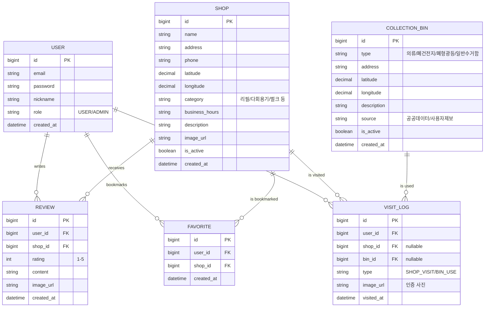

# 🌿 ESG 기반 제로 웨이스트샵 & 수거함 지도 — 프로젝트 준비 가이드

> **작성일**: 2026년 3월 24일  
> **기반**: IBM 특강 7단계 프레임워크 + 기존 기획서 템플릿 적용

---

## 📌 프로젝트 한눈에 보기

```
ESG 기반 제로 웨이스트샵 & 수거함 지도
│
├── 🗺️ 지도 기반 제로 웨이스트샵 / 수거함 위치 탐색
├── 📊 ESG 데이터 시각화 (참여 통계, 환경 기여도)
├── 🏪 매장 상세 정보 & 리뷰
├── 👤 사용자 참여 기록 (방문 인증, 수거 인증)
└── 🔧 관리자 매장/수거함 관리
```

---

## 1️⃣ 프로젝트를 시작하기 전에 준비할 것들

### ✅ Step 1: 주제 구체화 & 벤치마킹 리서치

ESG + 제로 웨이스트는 **사회적 가치**가 높은 주제입니다. 하지만 범위가 넓어질 수 있으므로 **핵심 가치 하나**를 명확히 정의하세요.

> [!IMPORTANT]
> **핵심 질문**: "이 서비스를 통해 사용자가 얻는 가치는 무엇인가?"
> - 예: "내 주변의 제로 웨이스트샵과 분리수거함을 쉽게 찾고, ESG 실천을 기록할 수 있는 서비스"

#### 🔍 벤치마킹 추천 서비스

| 서비스명 | URL | 참고할 점 |
|---------|-----|----------|
| 제로 웨이스트샵 지도 (알맹상점) | https://almang.me | 국내 제로 웨이스트샵 위치 정보 |
| 내 손 안의 분리배출 (환경부) | 모바일 앱 | 분리배출 가이드, 수거함 위치 |
| 당근마켓 동네지도 | https://www.daangn.com | 지역 기반 UI/UX 패턴 |
| 네이버 지도 / 카카오맵 | - | 지도 기반 서비스 UI, 필터링 |
| OpenStreetMap 기반 서비스들 | https://www.openstreetmap.org | 오픈소스 지도 데이터 활용법 |

#### 📊 공공데이터 활용 가능 목록

| 데이터명 | 출처 | 활용 방법 |
|---------|------|----------|
| 의류수거함 위치 데이터 | [공공데이터포털](https://www.data.go.kr) | 수거함 좌표 → 지도 마커 표시 |
| 재활용 선별장 위치 | 공공데이터포털 | 수거함 + 선별장 연계 정보 |
| 폐건전지/폐형광등 수거함 | 각 지자체 | 특수 수거함 위치 정보 |
| 제로 웨이스트샵 목록 | 자체 크롤링 / 직접 수집 | 매장 정보 DB 구축 |

> [!TIP]
> **공공데이터포털(`data.go.kr`)에서 "수거함", "재활용", "분리수거" 키워드로 검색하면 다양한 API를 찾을 수 있습니다.** CSV → DB 적재 파이프라인을 구축하는 것도 좋은 포트폴리오 포인트입니다.

---

### ✅ Step 2: 기능 범위 정의 (MoSCoW 방법론)

> [!WARNING]
> 가장 흔한 실수: **기능을 너무 많이 넣으려는 것**. IBM 강사 조언대로 "핵심 기능에 집중"하세요.

#### 🟢 Must (반드시 구현)

| # | 기능 | 설명 | 기술 키워드 |
|---|------|------|------------|
| 1 | **지도 기반 매장/수거함 탐색** | 카카오맵/네이버맵 API로 위치 표시, 필터링 | Map API, GeoJSON |
| 2 | **매장 상세 정보** | 영업시간, 취급 품목, 사진, 주소 | CRUD, REST API |
| 3 | **회원가입/로그인** | JWT 인증, 마이페이지 | Spring Security, JWT |
| 4 | **매장/수거함 검색 & 필터** | 카테고리별, 거리순, 키워드 검색 | JPA Query, 위치 기반 정렬 |
| 5 | **관리자 페이지** | 매장/수거함 CRUD, 회원 관리 | Admin Dashboard |
| 6 | **다국어 지원 (i18n)** | 한국어/영어 언어 전환, UI 텍스트 다국어 처리 | react-i18next, JSON 번역 파일 |

#### 🟡 Should (가산점 요소)

| # | 기능 | 설명 | 기술 키워드 |
|---|------|------|------------|
| 1 | **리뷰 & 별점** | 매장 방문 후기, 평점 | CRUD + 평균 계산 |
| 2 | **방문/수거 인증** | 사진 업로드 기반 인증 | File Upload, S3 |
| 3 | **ESG 참여 통계** | 개인별/지역별 환경 기여도 시각화 | Chart.js, Recharts |
| 4 | **매장 즐겨찾기** | 자주 가는 매장 북마크 | User-Shop 관계 |

#### 🔴 Could (시간이 남으면)

| # | 기능 | 설명 |
|---|------|------|
| 1 | 수거함 제보 (사용자 등록) | 사용자가 수거함 위치를 제보하는 크라우드소싱 |
| 2 | 실시간 매장 혼잡도 | WebSocket 기반 실시간 상태 |
| 3 | ESG 챌린지 / 뱃지 시스템 | 게이미피케이션 요소 |
| 4 | SNS 공유 | 카카오 공유 API |

#### ❌ Won't (제외 추천)

| 기능 | 제외 사유 |
|------|----------|
| 결제 / 전자상거래 | 범위 초과, 핵심 기능 아님 |
| AI 기반 추천 시스템 | 학습 비용 과다, 4주 내 구현 어려움 |
| 네이티브 모바일 앱 | 웹 반응형으로 대체 |

---

### ✅ Step 3: 기술 스택 결정

> 기존 학원 교육과정(React + Spring Boot)을 기반으로, 이 주제에 **필수적으로 추가해야 할 기술**을 정리합니다.

#### 🖥️ 프론트엔드

| 항목 | 추천 기술 | 선택 이유 |
|------|----------|----------|
| 프레임워크 | **React** | 학원 교육 기반, 생태계 풍부 |
| 스타일링 | **TailwindCSS** or **CSS Modules** | 빠른 UI 개발 (이전 대화에서 비교 진행) |
| 상태관리 | **Zustand** | 가볍고 직관적 |
| 🗺️ **지도** | **Kakao Maps SDK** or **Naver Maps API** | 국내 주소 체계 최적화, 무료 할당량 충분 |
| 차트 | **Recharts** or **Chart.js** | ESG 통계 시각화 |
| 🌐 **다국어** | **react-i18next** | React 표준 i18n 라이브러리, JSON 기반 번역 파일 관리 |

#### ⚙️ 백엔드

| 항목 | 추천 기술 | 선택 이유 |
|------|----------|----------|
| 프레임워크 | **Spring Boot 3.x** | 학원 교육 기반 |
| 데이터베이스 | **MariaDB** | MySQL 호환, 교육과 동일 |
| 인증 | **Spring Security + JWT** | REST API 인증 표준 |
| 파일 업로드 | **AWS S3** or **로컬 저장** | 리뷰 사진, 인증 사진 저장 |
| API 문서 | **Swagger (OpenAPI 3.0)** | 자동 문서화 |
| 📍 **위치 기반** | **JPA + Haversine 공식** or **MySQL Spatial** | 현재 위치 기반 거리 정렬 |

#### 🚀 인프라 / DevOps

| 항목 | 추천 기술 | 선택 이유 |
|------|----------|----------|
| 배포 | **Docker + AWS EC2** | Cloud Native 필수 |
| CI/CD | **GitHub Actions** | 가장 간단한 파이프라인 |

> [!NOTE]
> **지도 API 선택은 프로젝트 초기에 반드시 결정해야 합니다.**
> - **카카오맵**: 무료 일 30만 건, React 래퍼(`react-kakao-maps-sdk`) 존재
> - **네이버맵**: 무료 일 6만 건, React 래퍼 비공식이지만 존재
> - API 키 발급에 1~2일 걸릴 수 있으므로 **1주차 초반에 신청**하세요.

---

### ✅ Step 4: 데이터 설계 (ERD 초안)



#### 핵심 엔티티 요약

| 엔티티 | 설명 | 핵심 속성 |
|--------|------|----------|
| `User` | 사용자 | email, nickname, role |
| `Shop` | 제로 웨이스트샵 | name, address, lat/lng, category |
| `CollectionBin` | 수거함 | type, address, lat/lng, source |
| `Review` | 매장 리뷰 | user_id, shop_id, rating, content |
| `Favorite` | 즐겨찾기 | user_id, shop_id |
| `VisitLog` | 방문/수거 인증 | user_id, shop_id/bin_id, image |

---

### ✅ Step 5: 화면 구성 계획

```
[사용자 Flow]
메인(지도) → 로그인/회원가입 → 지도에서 매장/수거함 탐색 → 매장 상세
                                    ├→ 필터링 (카테고리, 거리순)      ├→ 리뷰 작성
                                    ├→ 검색                          ├→ 즐겨찾기
                                    └→ 내 주변 보기                   └→ 방문 인증
                              → 마이페이지 (내 리뷰, 즐겨찾기, ESG 통계)

[관리자 Flow]
관리자 로그인 → 관리자 대시보드 → 매장 관리 (CRUD)
                                → 수거함 관리 (CRUD + 공공데이터 일괄 등록)
                                → 리뷰 관리 (신고 처리)
                                → 통계 조회
```

#### 주요 화면 목록

| # | 화면명 | 설명 | 우선순위 |
|---|-------|------|---------|
| 1 | 🗺️ 메인 지도 | 지도 중심, 매장/수거함 마커 표시, 필터 | P1 |
| 2 | 🔐 로그인/회원가입 | JWT 인증 | P1 |
| 3 | 🏪 매장 상세 | 매장 정보, 리뷰, 즐겨찾기 | P1 |
| 4 | 🗑️ 수거함 상세 | 수거함 위치, 유형, 상세 정보 | P1 |
| 5 | 🔍 검색 & 필터 | 카테고리/키워드/거리 필터링 | P1 |
| 6 | 👤 마이페이지 | 내 리뷰, 즐겨찾기, 방문 기록 | P2 |
| 7 | 📊 ESG 통계 | 환경 기여도 차트, 지역별 통계 | P2 |
| 8 | ⚙️ 관리자 대시보드 | 매장/수거함/리뷰 CRUD | P2 |

---

### ✅ Step 6: 4주 일정 계획

```
                    1주차        2주차        3주차        4주차
                 ┌──────────┬──────────┬──────────┬──────────┐
 기획/설계        │████████  │          │          │          │
 데이터(ERD/DB)   │████████  │          │          │          │
 백엔드 API      │          │████████  │████████  │          │
 프론트(지도+UI)  │          │████████  │████████  │          │
 배포/DevOps     │          │          │          │████████  │
 테스트/수정      │          │          │          │████████  │
 발표 준비        │          │          │          │████████  │
                 └──────────┴──────────┴──────────┴──────────┘
```

| 주차 | 핵심 할 일 | 산출물 |
|------|-----------|-------|
| **1주차** | 요구사항 정의, ERD 확정, 와이어프레임, API 설계, **지도 API 키 발급**, 공공데이터 수집 | 기획서, ERD, 와이어프레임, WBS |
| **2주차** | DB 구축, 핵심 API(매장/수거함 CRUD, 회원, 지도 조회), 프론트 레이아웃 + 지도 연동 | DB 스키마, API 엔드포인트, 지도 화면 |
| **3주차** | 리뷰, 즐겨찾기, 검색/필터, 관리자 페이지, ESG 통계 차트, API 연동 완료 | 전체 기능 구현 |
| **4주차** | Docker 컨테이너화, CI/CD, 통합 테스트, 버그 수정, Swagger 문서, 발표 PPT | 배포, 문서, 발표 |

---

## 2️⃣ 팀 역할 분담 제안

> 4인 팀 기준 (인원수에 맞게 조정)

| 역할 | 담당 영역 | 1주차 | 2~3주차 | 4주차 |
|------|----------|-------|--------|-------|
| **팀장/프론트** | 지도 연동, 메인 UI, 반응형 | 와이어프레임, 지도 API 테스트 | 지도 화면, 매장 상세, 검색 UI | 통합 테스트, 발표 |
| **프론트** | 마이페이지, 관리자, 차트 | 화면 설계 | 마이페이지, 관리자 UI, 차트 | UI 수정, 발표 PPT |
| **백엔드** | API 개발, DB 설계 | ERD, API 설계 | 매장/수거함/회원 API, JWT | Swagger, 테스트 |
| **백엔드/인프라** | API + 배포 | 공공데이터 수집, API 설계 | 리뷰/즐겨찾기 API, 파일 업로드 | Docker, CI/CD, 배포 |

---

## 3️⃣ 이 주제의 강점 & 약점 분석

### 💪 강점 (발표 때 어필 포인트)

1. **ESG 트렌드 부합** — 기업들의 ESG 경영이 화두인 시점에서 사회적 가치를 담은 프로젝트
2. **공공데이터 활용** — `data.go.kr` API 연동 → 실제 데이터 기반 서비스
3. **지도 기반 서비스** — 시각적 완성도가 높고 데모 효과가 뛰어남
4. **실용적** — 실제로 사용할 수 있는 서비스 → 포트폴리오 가치 높음
5. **확장 가능성** — 수거함 크라우드소싱, 챌린지 시스템 등 확장 여지

### ⚠️ 주의할 점

1. **지도 API 의존성** — 지도 API가 프로젝트의 핵심이므로 **1주차에 반드시 연동 테스트**
2. **데이터 수집** — 제로 웨이스트샵 데이터는 공공데이터가 부족할 수 있음 → **직접 더미 데이터 구축** 필요
3. **위치 기반 쿼리** — "내 주변 N km 이내 매장 검색"은 DB 쿼리 최적화 필요 (Haversine 공식 or MySQL Spatial Index)
4. **범위 관리** — ESG 관련 기능을 너무 넓게 잡지 말 것 (탄소 발자국 계산 등은 4주 내 어려움)

---

## 4️⃣ 바로 시작할 수 있는 Action Items

### 📋 이번 주(1주차)에 해야 할 체크리스트

- [ ] **팀 미팅**: 이 가이드를 공유하고 기능 범위 확정
- [ ] **지도 API 결정 & 키 발급**: 카카오맵 vs 네이버맵 (추천: 카카오맵)
- [ ] **공공데이터 API 탐색**: `data.go.kr`에서 수거함 데이터 검색 & API 키 신청
- [ ] **벤치마킹**: 알맹상점, 환경부 앱 등 유사 서비스 스크린샷 수집
- [ ] **와이어프레임 작성**: Figma or 손 그림으로 주요 화면 8개 레이아웃
- [ ] **ERD 확정**: 위 초안을 기반으로 팀 논의 후 확정
- [ ] **API 설계서 작성**: 엔드포인트 목록 + 요청/응답 명세
- [ ] **기술 스택 최종 확정**: 프론트(React + 지도) + 백엔드(Spring Boot + MariaDB)
- [ ] **GitHub 리포지토리 생성**: 폴더 구조 잡기, `.gitignore`, README 작성
- [ ] **기획서 작성**: 기존 템플릿([프로젝트_기획서_템플릿.md](file:///Users/seobeom/Desktop/Project/1st_Project/%ED%94%84%EB%A1%9C%EC%A0%9D%ED%8A%B8_%EA%B8%B0%ED%9A%8D%EC%84%9C_%ED%85%9C%ED%94%8C%EB%A6%BF.md)) 활용

---

## 5️⃣ API 설계 초안 (참고용)

| Method | Endpoint | 설명 | 인증 |
|--------|----------|------|------|
| `POST` | `/api/auth/signup` | 회원가입 | ❌ |
| `POST` | `/api/auth/login` | 로그인 (JWT 발급) | ❌ |
| `GET` | `/api/shops` | 매장 목록 (필터: category, lat/lng, radius) | ❌ |
| `GET` | `/api/shops/{id}` | 매장 상세 | ❌ |
| `POST` | `/api/shops` | 매장 등록 (관리자) | ✅ ADMIN |
| `PUT` | `/api/shops/{id}` | 매장 수정 (관리자) | ✅ ADMIN |
| `DELETE` | `/api/shops/{id}` | 매장 삭제 (관리자) | ✅ ADMIN |
| `GET` | `/api/bins` | 수거함 목록 (필터: type, lat/lng, radius) | ❌ |
| `GET` | `/api/bins/{id}` | 수거함 상세 | ❌ |
| `GET` | `/api/shops/{id}/reviews` | 매장 리뷰 목록 | ❌ |
| `POST` | `/api/shops/{id}/reviews` | 리뷰 작성 | ✅ USER |
| `POST` | `/api/favorites/{shopId}` | 즐겨찾기 추가 | ✅ USER |
| `DELETE` | `/api/favorites/{shopId}` | 즐겨찾기 삭제 | ✅ USER |
| `GET` | `/api/users/me` | 내 정보 | ✅ USER |
| `GET` | `/api/users/me/stats` | 내 ESG 통계 | ✅ USER |
| `GET` | `/api/stats/region` | 지역별 ESG 통계 | ❌ |

---

> [!TIP]
> 💡 **기획서 작성 시 팁**: 기존 [프로젝트_기획서_템플릿.md](file:///Users/seobeom/Desktop/Project/1st_Project/%ED%94%84%EB%A1%9C%EC%A0%9D%ED%8A%B8_%EA%B8%B0%ED%9A%8D%EC%84%9C_%ED%85%9C%ED%94%8C%EB%A6%BF.md)을 복사하여 `기획서_G_ZeroWasteMap.md` 파일로 만들고, 이 가이드의 내용을 채워 넣으면 빠르게 기획서를 완성할 수 있습니다.

> [!CAUTION]
> **지도 API 키 발급은 반드시 1주차 월요일에 신청하세요!** 카카오/네이버 모두 앱 등록 및 승인 과정이 있으며, 도메인 등록이 필요할 수 있습니다. 늦으면 2주차 개발에 영향을 줍니다.
