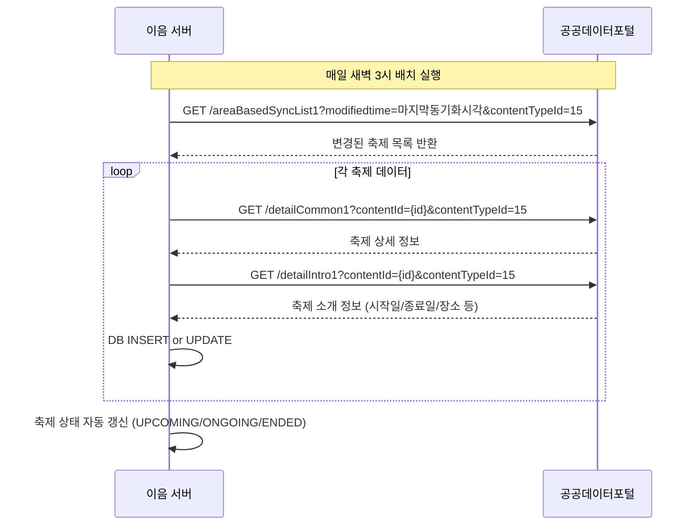

# 📡 API 명세서 — 공공데이터포털 (한국관광공사 국문 관광정보 서비스)

> **프로젝트**: 지역 축제 통합 정보 플랫폼 (이음)  
> **작성일**: 2026년 3월 27일  
> **작성자**: 서범  
> **버전**: v1.0  
> **데이터 출처**: [한국관광공사_국문 관광정보 서비스_GW](https://www.data.go.kr/data/15101578/openapi.do)  
> **Base URL**: `https://apis.data.go.kr/B551011/KorService2`

---

## 1. 개요

### 1-1. 서비스 설명
한국관광공사가 보유한 전국의 관광정보(약 26만 건)를 실시간으로 제공하는 OpenAPI입니다. 지역코드, 서비스분류, 관광지, 축제/공연/행사, 숙박 등 15종의 관광 데이터를 국문으로 제공합니다.

### 1-2. 인증 방식

| 항목 | 내용 |
|------|------|
| **인증키** | 공공데이터포털에서 발급받은 `serviceKey` (URL Encoding 필수) |
| **인증 방식** | Query Parameter 방식 |
| **호출 제한** | 일 1,000건 (트래픽 초과 시 429 에러) |
| **응답 형식** | XML (기본) / JSON (`_type=json` 파라미터 추가) |

### 1-3. 공통 요청 파라미터

> 모든 API에 공통으로 적용되는 필수/선택 파라미터

| 파라미터 | 타입 | 필수 | 기본값 | 설명 |
|---------|------|------|-------|------|
| `serviceKey` | string | ✅ | — | 공공데이터포털 발급 인증키 (URL Encoding) |
| `MobileOS` | string | ✅ | — | OS 구분: `AND` / `IOS` / `ETC` |
| `MobileApp` | string | ✅ | — | 서비스명 (앱 이름, 예: `IEUM`) |
| `_type` | string | ❌ | xml | 응답 형식: `json` / `xml` |
| `numOfRows` | int | ❌ | 10 | 한 페이지당 결과 수 |
| `pageNo` | int | ❌ | 1 | 페이지 번호 |

### 1-4. 공통 응답 구조

```json
{
  "response": {
    "header": {
      "resultCode": "0000",
      "resultMsg": "OK"
    },
    "body": {
      "items": {
        "item": [ ... ]
      },
      "numOfRows": 10,
      "pageNo": 1,
      "totalCount": 150
    }
  }
}
```

### 1-5. contentTypeId (관광 타입 코드)

| 코드 | 타입명 |
|------|--------|
| 12 | 관광지 |
| 14 | 문화시설 |
| 15 | **축제공연행사** ⭐ (이음 프로젝트 핵심) |
| 25 | 여행코스 |
| 28 | 레포츠 |
| 32 | 숙박 |
| 38 | 쇼핑 |
| 39 | 음식점 |

### 1-6. 에러 코드

| 에러 코드 | 에러 메시지 | 설명 |
|----------|-----------|------|
| `0000` | OK | 정상 |
| `1` | APPLICATION_ERROR | 애플리케이션 에러 |
| `4` | HTTP_ERROR | HTTP 에러 |
| `12` | NO_OPENAPI_SERVICE_ERROR | 해당 서비스 없음 |
| `20` | SERVICE_ACCESS_DENIED_ERROR | 서비스 접근 거부 |
| `22` | LIMITED_NUMBER_OF_SERVICE_REQUESTS_EXCEEDS_ERROR | 트래픽 초과 |
| `30` | SERVICE_KEY_IS_NOT_REGISTERED_ERROR | 등록되지 않은 서비스키 |
| `31` | DEADLINE_HAS_EXPIRED_ERROR | 활용기간 만료 |
| `32` | UNREGISTERED_IP_ERROR | 등록되지 않은 IP |

---

## 2. API 총괄표

| No | 오퍼레이션 | Endpoint | 설명 |
|----|----------|----------|------|
| 1 | `areaCode1` | `/areaCode1` | 지역코드 조회 |
| 2 | `detailPetTour1` | `/detailPetTour1` | 반려동물 동반 여행 정보 |
| 3 | `categoryCode1` | `/categoryCode1` | 서비스 분류코드 조회 |
| 4 | `areaBasedList1` | `/areaBasedList1` | 지역기반 관광정보 조회 |
| 5 | `locationBasedList1` | `/locationBasedList1` | 위치기반 관광정보 조회 |
| 6 | `searchKeyword1` | `/searchKeyword1` | 키워드 검색 조회 |
| 7 | `detailCommon1` | `/detailCommon1` | 공통정보 조회 |
| 8 | `detailIntro1` | `/detailIntro1` | 소개정보 조회 |
| 9 | `detailInfo1` | `/detailInfo1` | 반복정보 조회 |
| 10 | `detailImage1` | `/detailImage1` | 이미지정보 조회 |
| 11 | `categoryCode1` | `/categoryCode1` | 분류체계 코드 조회 |
| 12 | `areaBasedSyncList1` | `/areaBasedSyncList1` | 관광정보 동기화 목록 조회 |
| 13 | `areaCode1` | `/areaCode1` | 법정동코드 조회 (areaCode 하위) |

---

## 3. API 상세 명세

---

### 3-1. 지역코드 조회 (`areaCode1`)

| 항목 | 내용 |
|------|------|
| **엔드포인트** | `GET /areaCode1` |
| **전체 URL** | `https://apis.data.go.kr/B551011/KorService2/areaCode1` |
| **설명** | 시/도 및 시군구 지역코드 목록을 조회 |

**요청 파라미터 (공통 파라미터 + 아래):**

| 파라미터 | 타입 | 필수 | 설명 |
|---------|------|------|------|
| `areaCode` | string | ❌ | 지역코드 (미입력 시 시/도 목록, 입력 시 해당 시/도의 시군구 목록) |

**요청 예시:**
```
GET /areaCode1?serviceKey={KEY}&MobileOS=ETC&MobileApp=IEUM&_type=json
GET /areaCode1?serviceKey={KEY}&MobileOS=ETC&MobileApp=IEUM&_type=json&areaCode=1
```

**응답 (200 OK):**
```json
{
  "response": {
    "header": { "resultCode": "0000", "resultMsg": "OK" },
    "body": {
      "items": {
        "item": [
          { "rnum": 1, "code": "1", "name": "서울" },
          { "rnum": 2, "code": "2", "name": "인천" },
          { "rnum": 3, "code": "3", "name": "대전" },
          { "rnum": 4, "code": "4", "name": "대구" },
          { "rnum": 5, "code": "5", "name": "광주" },
          { "rnum": 6, "code": "6", "name": "부산" },
          { "rnum": 7, "code": "7", "name": "울산" },
          { "rnum": 8, "code": "8", "name": "세종특별자치시" },
          { "rnum": 9, "code": "31", "name": "경기도" },
          { "rnum": 10, "code": "32", "name": "강원특별자치도" },
          { "rnum": 11, "code": "33", "name": "충청북도" },
          { "rnum": 12, "code": "34", "name": "충청남도" },
          { "rnum": 13, "code": "35", "name": "경상북도" },
          { "rnum": 14, "code": "36", "name": "경상남도" },
          { "rnum": 15, "code": "37", "name": "전북특별자치도" },
          { "rnum": 16, "code": "38", "name": "전라남도" },
          { "rnum": 17, "code": "39", "name": "제주도" }
        ]
      },
      "numOfRows": 10,
      "pageNo": 1,
      "totalCount": 17
    }
  }
}
```

**응답 필드:**

| 필드 | 타입 | 설명 |
|------|------|------|
| `rnum` | int | 일련번호 |
| `code` | string | 지역 코드 |
| `name` | string | 지역명 |

---

### 3-2. 반려동물 동반 여행 정보 (`detailPetTour1`)

| 항목 | 내용 |
|------|------|
| **엔드포인트** | `GET /detailPetTour1` |
| **전체 URL** | `https://apis.data.go.kr/B551011/KorService2/detailPetTour1` |
| **설명** | 특정 콘텐츠의 반려동물 동반 여행 관련 정보 조회 |

**요청 파라미터 (공통 파라미터 + 아래):**

| 파라미터 | 타입 | 필수 | 설명 |
|---------|------|------|------|
| `contentId` | string | ✅ | 콘텐츠 ID |
| `contentTypeId` | string | ✅ | 관광 타입 ID |

**요청 예시:**
```
GET /detailPetTour1?serviceKey={KEY}&MobileOS=ETC&MobileApp=IEUM&_type=json&contentId=2845612&contentTypeId=12
```

**응답 (200 OK):**
```json
{
  "response": {
    "header": { "resultCode": "0000", "resultMsg": "OK" },
    "body": {
      "items": {
        "item": [
          {
            "contentid": "2845612",
            "contenttypeid": "12",
            "relaAcdntRiskMtr": "관련 사고 위험 사항",
            "acmpyTypeCd": "동반 유형 코드",
            "relaPosesFclty": "관련 구비 시설",
            "relaFrnshPrdlst": "관련 비품 목록",
            "etcAcmpyInfo": "기타 동반 정보",
            "relaPurcPrdlst": "관련 구매 물품 목록",
            "acmpyPsblCpam": "동반 가능 동물",
            "acmpyNeedMtr": "동반 필요 사항"
          }
        ]
      },
      "numOfRows": 10,
      "pageNo": 1,
      "totalCount": 1
    }
  }
}
```

**응답 필드:**

| 필드 | 타입 | 설명 |
|------|------|------|
| `contentid` | string | 콘텐츠 ID |
| `contenttypeid` | string | 콘텐츠 타입 ID |
| `acmpyTypeCd` | string | 동반 유형 코드 |
| `acmpyPsblCpam` | string | 동반 가능 동물 |
| `acmpyNeedMtr` | string | 동반 시 필요 사항 |
| `relaFrnshPrdlst` | string | 관련 비품 목록 |
| `relaPosesFclty` | string | 관련 시설 정보 |
| `relaPurcPrdlst` | string | 관련 구매 가능 물품 |
| `relaAcdntRiskMtr` | string | 관련 사고 위험 사항 |
| `etcAcmpyInfo` | string | 기타 동반 정보 |

---

### 3-3. 서비스 분류코드 조회 (`categoryCode1`)

| 항목 | 내용 |
|------|------|
| **엔드포인트** | `GET /categoryCode1` |
| **전체 URL** | `https://apis.data.go.kr/B551011/KorService2/categoryCode1` |
| **설명** | 서비스 분류(대/중/소분류) 코드 목록 조회 |

**요청 파라미터 (공통 파라미터 + 아래):**

| 파라미터 | 타입 | 필수 | 설명 |
|---------|------|------|------|
| `contentTypeId` | string | ❌ | 관광 타입 ID |
| `cat1` | string | ❌ | 대분류 코드 (미입력 시 대분류 목록) |
| `cat2` | string | ❌ | 중분류 코드 (미입력 시 중분류 목록, cat1 필수) |
| `cat3` | string | ❌ | 소분류 코드 (미입력 시 소분류 목록, cat2 필수) |

**요청 예시:**
```
# 대분류 조회
GET /categoryCode1?serviceKey={KEY}&MobileOS=ETC&MobileApp=IEUM&_type=json&contentTypeId=15

# 중분류 조회
GET /categoryCode1?serviceKey={KEY}&MobileOS=ETC&MobileApp=IEUM&_type=json&contentTypeId=15&cat1=A02

# 소분류 조회
GET /categoryCode1?serviceKey={KEY}&MobileOS=ETC&MobileApp=IEUM&_type=json&contentTypeId=15&cat1=A02&cat2=A0207
```

**응답 (200 OK):**
```json
{
  "response": {
    "header": { "resultCode": "0000", "resultMsg": "OK" },
    "body": {
      "items": {
        "item": [
          { "rnum": 1, "code": "A01", "name": "자연" },
          { "rnum": 2, "code": "A02", "name": "인문(문화/예술/역사)" },
          { "rnum": 3, "code": "A03", "name": "레포츠" },
          { "rnum": 4, "code": "A04", "name": "쇼핑" },
          { "rnum": 5, "code": "A05", "name": "음식" },
          { "rnum": 6, "code": "B02", "name": "숙박" },
          { "rnum": 7, "code": "C01", "name": "추천코스" }
        ]
      },
      "numOfRows": 10,
      "pageNo": 1,
      "totalCount": 7
    }
  }
}
```

**응답 필드:**

| 필드 | 타입 | 설명 |
|------|------|------|
| `rnum` | int | 일련번호 |
| `code` | string | 분류 코드 |
| `name` | string | 분류명 |

---

### 3-4. 지역기반 관광정보 조회 (`areaBasedList1`)

| 항목 | 내용 |
|------|------|
| **엔드포인트** | `GET /areaBasedList1` |
| **전체 URL** | `https://apis.data.go.kr/B551011/KorService2/areaBasedList1` |
| **설명** | 지역 코드 기반으로 관광정보 목록 조회 (축제 목록 조회의 핵심 API) |

**요청 파라미터 (공통 파라미터 + 아래):**

| 파라미터 | 타입 | 필수 | 설명 |
|---------|------|------|------|
| `contentTypeId` | string | ❌ | 관광 타입 ID (15=축제공연행사) |
| `areaCode` | string | ❌ | 지역코드 (미입력 시 전국) |
| `sigunguCode` | string | ❌ | 시군구코드 (areaCode 필수) |
| `cat1` | string | ❌ | 대분류 코드 |
| `cat2` | string | ❌ | 중분류 코드 |
| `cat3` | string | ❌ | 소분류 코드 |
| `listYN` | string | ❌ | 목록 구분 (`Y`=목록, `N`=개수) |
| `arrange` | string | ❌ | 정렬: `A`=제목순, `C`=수정일순, `D`=생성일순, `O`=제목순(대표이미지 있는것만), `Q`=제목순(대표이미지 있는것만), `R`=생성일순(대표이미지 있는것만) |
| `modifiedtime` | string | ❌ | 수정일 (YYYYMMDD) |

**요청 예시:**
```
# 서울 지역 축제 목록 조회
GET /areaBasedList1?serviceKey={KEY}&MobileOS=ETC&MobileApp=IEUM&_type=json
    &contentTypeId=15&areaCode=1&numOfRows=10&pageNo=1&arrange=D
```

**응답 (200 OK):**
```json
{
  "response": {
    "header": { "resultCode": "0000", "resultMsg": "OK" },
    "body": {
      "items": {
        "item": [
          {
            "addr1": "서울특별시 영등포구 여의서로",
            "addr2": "(여의도동)",
            "areacode": "1",
            "booktour": "",
            "cat1": "A02",
            "cat2": "A0207",
            "cat3": "A02070200",
            "contentid": "2845612",
            "contenttypeid": "15",
            "createdtime": "20240301120000",
            "firstimage": "https://tong.visitkorea.or.kr/cms/resource/12/2845612_image1.jpg",
            "firstimage2": "https://tong.visitkorea.or.kr/cms/resource/12/2845612_image2.jpg",
            "cpyrhtDivCd": "Type1",
            "mapx": "126.9219",
            "mapy": "37.5217",
            "mlevel": "6",
            "modifiedtime": "20260301120000",
            "sigungucode": "21",
            "tel": "02-1234-5678",
            "title": "서울 벚꽃 축제 2026",
            "zipcode": "07241"
          }
        ]
      },
      "numOfRows": 10,
      "pageNo": 1,
      "totalCount": 45
    }
  }
}
```

**응답 필드:**

| 필드 | 타입 | 설명 |
|------|------|------|
| `contentid` | string | 콘텐츠 ID |
| `contenttypeid` | string | 콘텐츠 타입 ID |
| `title` | string | 제목 (축제명) |
| `addr1` | string | 주소 |
| `addr2` | string | 상세 주소 |
| `areacode` | string | 지역 코드 |
| `sigungucode` | string | 시군구 코드 |
| `cat1` | string | 대분류 코드 |
| `cat2` | string | 중분류 코드 |
| `cat3` | string | 소분류 코드 |
| `firstimage` | string | 대표 이미지 URL (원본) |
| `firstimage2` | string | 대표 이미지 URL (썸네일) |
| `cpyrhtDivCd` | string | 저작권 유형 (Type1=1유형, Type3=3유형) |
| `mapx` | string | 경도 (longitude) |
| `mapy` | string | 위도 (latitude) |
| `mlevel` | string | 지도 레벨 |
| `tel` | string | 전화번호 |
| `zipcode` | string | 우편번호 |
| `createdtime` | string | 등록일 (YYYYMMDDHHMMSS) |
| `modifiedtime` | string | 수정일 (YYYYMMDDHHMMSS) |
| `booktour` | string | 교과서속여행지 여부 |

---

### 3-5. 위치기반 관광정보 조회 (`locationBasedList1`)

| 항목 | 내용 |
|------|------|
| **엔드포인트** | `GET /locationBasedList1` |
| **전체 URL** | `https://apis.data.go.kr/B551011/KorService2/locationBasedList1` |
| **설명** | GPS 좌표 기반으로 반경 내 관광정보 조회 (지도 화면 핵심 API) |

**요청 파라미터 (공통 파라미터 + 아래):**

| 파라미터 | 타입 | 필수 | 설명 |
|---------|------|------|------|
| `mapX` | double | ✅ | 경도 (longitude) |
| `mapY` | double | ✅ | 위도 (latitude) |
| `radius` | int | ✅ | 검색 반경 (단위: m, 최대 20000) |
| `contentTypeId` | string | ❌ | 관광 타입 ID |
| `listYN` | string | ❌ | `Y`=목록, `N`=개수 |
| `arrange` | string | ❌ | 정렬: `A`=제목순, `C`=수정일순, `D`=생성일순, `E`=거리순 |
| `modifiedtime` | string | ❌ | 수정일 (YYYYMMDD) |

**요청 예시:**
```
# 여의도 주변 2km 반경 축제 조회
GET /locationBasedList1?serviceKey={KEY}&MobileOS=ETC&MobileApp=IEUM&_type=json
    &mapX=126.9219&mapY=37.5217&radius=2000&contentTypeId=15&arrange=E
```

**응답 (200 OK):**
```json
{
  "response": {
    "header": { "resultCode": "0000", "resultMsg": "OK" },
    "body": {
      "items": {
        "item": [
          {
            "addr1": "서울특별시 영등포구 여의서로",
            "contentid": "2845612",
            "contenttypeid": "15",
            "dist": "523",
            "firstimage": "https://tong.visitkorea.or.kr/cms/resource/12/2845612_image1.jpg",
            "mapx": "126.9219",
            "mapy": "37.5217",
            "tel": "02-1234-5678",
            "title": "서울 벚꽃 축제 2026"
          }
        ]
      },
      "numOfRows": 10,
      "pageNo": 1,
      "totalCount": 5
    }
  }
}
```

**추가 응답 필드:**

| 필드 | 타입 | 설명 |
|------|------|------|
| `dist` | string | 현재 위치로부터의 거리 (단위: m) |

> 나머지 필드는 `areaBasedList1` 응답과 동일

---

### 3-6. 키워드 검색 조회 (`searchKeyword1`)

| 항목 | 내용 |
|------|------|
| **엔드포인트** | `GET /searchKeyword1` |
| **전체 URL** | `https://apis.data.go.kr/B551011/KorService2/searchKeyword1` |
| **설명** | 키워드로 관광정보 검색 (검색 기능 핵심 API) |

**요청 파라미터 (공통 파라미터 + 아래):**

| 파라미터 | 타입 | 필수 | 설명 |
|---------|------|------|------|
| `keyword` | string | ✅ | 검색 키워드 (URL Encoding 필수) |
| `contentTypeId` | string | ❌ | 관광 타입 ID |
| `areaCode` | string | ❌ | 지역 코드 |
| `sigunguCode` | string | ❌ | 시군구 코드 |
| `cat1` | string | ❌ | 대분류 코드 |
| `cat2` | string | ❌ | 중분류 코드 |
| `cat3` | string | ❌ | 소분류 코드 |
| `listYN` | string | ❌ | `Y`=목록, `N`=개수 |
| `arrange` | string | ❌ | 정렬: `A`=제목순, `C`=수정일순, `D`=생성일순, `O`=제목순(이미지), `P`=인기도순 |

**요청 예시:**
```
# "벚꽃" 키워드로 축제 검색
GET /searchKeyword1?serviceKey={KEY}&MobileOS=ETC&MobileApp=IEUM&_type=json
    &keyword=%EB%B2%9A%EA%BD%83&contentTypeId=15&arrange=P
```

**응답 (200 OK):**

> `areaBasedList1`과 동일한 응답 구조 (item 배열)

---

### 3-7. 공통정보 조회 (`detailCommon1`)

| 항목 | 내용 |
|------|------|
| **엔드포인트** | `GET /detailCommon1` |
| **전체 URL** | `https://apis.data.go.kr/B551011/KorService2/detailCommon1` |
| **설명** | 특정 콘텐츠의 공통 상세 정보 조회 (축제 상세 화면 핵심 API) |

**요청 파라미터 (공통 파라미터 + 아래):**

| 파라미터 | 타입 | 필수 | 설명 |
|---------|------|------|------|
| `contentId` | string | ✅ | 콘텐츠 ID |
| `contentTypeId` | string | ✅ | 관광 타입 ID |
| `defaultYN` | string | ❌ | 기본 정보 조회 (`Y`/`N`) |
| `firstImageYN` | string | ❌ | 대표 이미지 조회 (`Y`/`N`) |
| `areacodeYN` | string | ❌ | 지역 코드 조회 (`Y`/`N`) |
| `catcodeYN` | string | ❌ | 서비스 분류 코드 조회 (`Y`/`N`) |
| `addrinfoYN` | string | ❌ | 주소 정보 조회 (`Y`/`N`) |
| `mapinfoYN` | string | ❌ | 좌표 정보 조회 (`Y`/`N`) |
| `overviewYN` | string | ❌ | 개요 정보 조회 (`Y`/`N`) |

**요청 예시:**
```
GET /detailCommon1?serviceKey={KEY}&MobileOS=ETC&MobileApp=IEUM&_type=json
    &contentId=2845612&contentTypeId=15
    &defaultYN=Y&firstImageYN=Y&addrinfoYN=Y&mapinfoYN=Y&overviewYN=Y
```

**응답 (200 OK):**
```json
{
  "response": {
    "header": { "resultCode": "0000", "resultMsg": "OK" },
    "body": {
      "items": {
        "item": [
          {
            "contentid": "2845612",
            "contenttypeid": "15",
            "title": "서울 벚꽃 축제 2026",
            "createdtime": "20240301120000",
            "modifiedtime": "20260301120000",
            "tel": "02-1234-5678",
            "telname": "서울 벚꽃 축제 사무국",
            "homepage": "<a href='https://yeouido-cherry.kr'>서울 벚꽃 축제</a>",
            "booktour": "",
            "firstimage": "https://tong.visitkorea.or.kr/cms/resource/12/2845612_image1.jpg",
            "firstimage2": "https://tong.visitkorea.or.kr/cms/resource/12/2845612_image2.jpg",
            "cpyrhtDivCd": "Type1",
            "areacode": "1",
            "sigungucode": "21",
            "cat1": "A02",
            "cat2": "A0207",
            "cat3": "A02070200",
            "addr1": "서울특별시 영등포구 여의서로",
            "addr2": "(여의도동)",
            "zipcode": "07241",
            "mapx": "126.9219",
            "mapy": "37.5217",
            "mlevel": "6",
            "overview": "여의도 윤중로에서 펼쳐지는 벚꽃 축제입니다. 야간 조명과 함께 특별한 봄을 만끽하세요."
          }
        ]
      },
      "numOfRows": 10,
      "pageNo": 1,
      "totalCount": 1
    }
  }
}
```

**응답 필드:**

| 필드 | 타입 | 설명 |
|------|------|------|
| `contentid` | string | 콘텐츠 ID |
| `contenttypeid` | string | 콘텐츠 타입 ID |
| `title` | string | 제목 |
| `homepage` | string | 홈페이지 URL (HTML 태그 포함) |
| `tel` | string | 전화번호 |
| `telname` | string | 전화번호명 |
| `overview` | string | 개요 설명 (HTML 포함 가능) |
| `firstimage` | string | 대표 이미지 원본 URL |
| `firstimage2` | string | 대표 이미지 썸네일 URL |
| `addr1` | string | 주소 |
| `addr2` | string | 상세 주소 |
| `mapx` | string | 경도 |
| `mapy` | string | 위도 |
| `areacode` | string | 지역 코드 |
| `sigungucode` | string | 시군구 코드 |
| `cat1`, `cat2`, `cat3` | string | 대/중/소분류 코드 |

---

### 3-8. 소개정보 조회 (`detailIntro1`)

| 항목 | 내용 |
|------|------|
| **엔드포인트** | `GET /detailIntro1` |
| **전체 URL** | `https://apis.data.go.kr/B551011/KorService2/detailIntro1` |
| **설명** | 콘텐츠 타입별 소개 정보 조회 (축제: 행사 시간, 장소, 이용 요금 등) |

**요청 파라미터 (공통 파라미터 + 아래):**

| 파라미터 | 타입 | 필수 | 설명 |
|---------|------|------|------|
| `contentId` | string | ✅ | 콘텐츠 ID |
| `contentTypeId` | string | ✅ | 관광 타입 ID |

**요청 예시:**
```
GET /detailIntro1?serviceKey={KEY}&MobileOS=ETC&MobileApp=IEUM&_type=json
    &contentId=2845612&contentTypeId=15
```

**응답 (200 OK) — contentTypeId=15 (축제공연행사):**
```json
{
  "response": {
    "header": { "resultCode": "0000", "resultMsg": "OK" },
    "body": {
      "items": {
        "item": [
          {
            "contentid": "2845612",
            "contenttypeid": "15",
            "sponsor1": "서울특별시",
            "sponsor1tel": "02-1234-5678",
            "sponsor2": "영등포구",
            "sponsor2tel": "02-2345-6789",
            "eventenddate": "20260410",
            "eventstartdate": "20260401",
            "eventplace": "여의도 윤중로 벚꽃길",
            "eventhomepage": "https://yeouido-cherry.kr",
            "playtime": "10:00 ~ 22:00",
            "program": "벚꽃 포토존, 먹거리 장터, 야간 조명쇼",
            "subevent": "벚꽃 사진 콘테스트",
            "usetimefestival": "무료",
            "discountinfofestival": "",
            "spendtimefestival": "약 2~3시간",
            "festivalgrade": ""
          }
        ]
      },
      "numOfRows": 10,
      "pageNo": 1,
      "totalCount": 1
    }
  }
}
```

**응답 필드 (축제공연행사 contentTypeId=15):**

| 필드 | 타입 | 설명 |
|------|------|------|
| `eventstartdate` | string | 행사 시작일 (YYYYMMDD) |
| `eventenddate` | string | 행사 종료일 (YYYYMMDD) |
| `eventplace` | string | 행사 장소 |
| `eventhomepage` | string | 행사 홈페이지 |
| `playtime` | string | 공연/행사 시간 |
| `program` | string | 행사 프로그램 |
| `subevent` | string | 부대 행사 |
| `usetimefestival` | string | 이용 요금 |
| `discountinfofestival` | string | 할인 정보 |
| `spendtimefestival` | string | 관람 소요 시간 |
| `festivalgrade` | string | 축제 등급 |
| `sponsor1` | string | 주최자 |
| `sponsor1tel` | string | 주최자 연락처 |
| `sponsor2` | string | 주관사 |
| `sponsor2tel` | string | 주관사 연락처 |

---

### 3-9. 반복정보 조회 (`detailInfo1`)

| 항목 | 내용 |
|------|------|
| **엔드포인트** | `GET /detailInfo1` |
| **전체 URL** | `https://apis.data.go.kr/B551011/KorService2/detailInfo1` |
| **설명** | 콘텐츠의 추가 반복 정보 조회 (수용인원, 주차시설 등) |

**요청 파라미터 (공통 파라미터 + 아래):**

| 파라미터 | 타입 | 필수 | 설명 |
|---------|------|------|------|
| `contentId` | string | ✅ | 콘텐츠 ID |
| `contentTypeId` | string | ✅ | 관광 타입 ID |

**요청 예시:**
```
GET /detailInfo1?serviceKey={KEY}&MobileOS=ETC&MobileApp=IEUM&_type=json
    &contentId=2845612&contentTypeId=15
```

**응답 (200 OK):**
```json
{
  "response": {
    "header": { "resultCode": "0000", "resultMsg": "OK" },
    "body": {
      "items": {
        "item": [
          {
            "contentid": "2845612",
            "contenttypeid": "15",
            "fldgubun": "",
            "infoname": "행사소개",
            "infotext": "서울의 대표적인 봄 축제로, 윤중로를 따라 벚꽃 터널이 형성됩니다.",
            "serialnum": "1"
          },
          {
            "contentid": "2845612",
            "contenttypeid": "15",
            "fldgubun": "",
            "infoname": "참여방법",
            "infotext": "현장 자유 관람, 사전 예약 불필요",
            "serialnum": "2"
          }
        ]
      },
      "numOfRows": 10,
      "pageNo": 1,
      "totalCount": 2
    }
  }
}
```

**응답 필드:**

| 필드 | 타입 | 설명 |
|------|------|------|
| `contentid` | string | 콘텐츠 ID |
| `contenttypeid` | string | 콘텐츠 타입 ID |
| `serialnum` | string | 일련번호 |
| `infoname` | string | 정보 항목명 |
| `infotext` | string | 정보 내용 |
| `fldgubun` | string | 구분 |

---

### 3-10. 이미지정보 조회 (`detailImage1`)

| 항목 | 내용 |
|------|------|
| **엔드포인트** | `GET /detailImage1` |
| **전체 URL** | `https://apis.data.go.kr/B551011/KorService2/detailImage1` |
| **설명** | 특정 콘텐츠의 이미지 목록 조회 |

**요청 파라미터 (공통 파라미터 + 아래):**

| 파라미터 | 타입 | 필수 | 설명 |
|---------|------|------|------|
| `contentId` | string | ✅ | 콘텐츠 ID |
| `imageYN` | string | ❌ | `Y`=원본, `N`=썸네일 |
| `subImageYN` | string | ❌ | `Y`=서브이미지 포함, `N`=대표이미지만 |

**요청 예시:**
```
GET /detailImage1?serviceKey={KEY}&MobileOS=ETC&MobileApp=IEUM&_type=json
    &contentId=2845612&imageYN=Y&subImageYN=Y
```

**응답 (200 OK):**
```json
{
  "response": {
    "header": { "resultCode": "0000", "resultMsg": "OK" },
    "body": {
      "items": {
        "item": [
          {
            "contentid": "2845612",
            "imgname": "벚꽃축제_메인",
            "originimgurl": "https://tong.visitkorea.or.kr/cms/resource/12/2845612_image1.jpg",
            "serialnum": "1",
            "cpyrhtDivCd": "Type1",
            "smallimageurl": "https://tong.visitkorea.or.kr/cms/resource/12/2845612_thumb1.jpg"
          },
          {
            "contentid": "2845612",
            "imgname": "벚꽃축제_야경",
            "originimgurl": "https://tong.visitkorea.or.kr/cms/resource/12/2845612_image2.jpg",
            "serialnum": "2",
            "cpyrhtDivCd": "Type1",
            "smallimageurl": "https://tong.visitkorea.or.kr/cms/resource/12/2845612_thumb2.jpg"
          }
        ]
      },
      "numOfRows": 10,
      "pageNo": 1,
      "totalCount": 2
    }
  }
}
```

**응답 필드:**

| 필드 | 타입 | 설명 |
|------|------|------|
| `contentid` | string | 콘텐츠 ID |
| `serialnum` | string | 일련번호 |
| `imgname` | string | 이미지 파일명 |
| `originimgurl` | string | 원본 이미지 URL |
| `smallimageurl` | string | 썸네일 이미지 URL |
| `cpyrhtDivCd` | string | 저작권 유형 코드 (Type1=공공누리1유형, Type3=3유형) |

---

### 3-11. 분류체계 코드 조회 (`categoryCode1`)

> 3-3. 서비스 분류코드 조회와 동일한 오퍼레이션 (`categoryCode1`)  
> `contentTypeId` 없이 호출하면 전체 분류 체계를 조회할 수 있음

**요청 예시 (전체 분류 체계):**
```
# contentTypeId 없이 전체 대분류 조회
GET /categoryCode1?serviceKey={KEY}&MobileOS=ETC&MobileApp=IEUM&_type=json

# 특정 대분류의 하위 체계 조회
GET /categoryCode1?serviceKey={KEY}&MobileOS=ETC&MobileApp=IEUM&_type=json&cat1=A02
GET /categoryCode1?serviceKey={KEY}&MobileOS=ETC&MobileApp=IEUM&_type=json&cat1=A02&cat2=A0207
```

> 응답 구조는 3-3과 동일 (code, name)

---

### 3-12. 관광정보 동기화 목록 조회 (`areaBasedSyncList1`)

| 항목 | 내용 |
|------|------|
| **엔드포인트** | `GET /areaBasedSyncList1` |
| **전체 URL** | `https://apis.data.go.kr/B551011/KorService2/areaBasedSyncList1` |
| **설명** | 최종 수정일 기준으로 변경된 관광정보 동기화 목록 조회 (배치 동기화 핵심 API) |

**요청 파라미터 (공통 파라미터 + 아래):**

| 파라미터 | 타입 | 필수 | 설명 |
|---------|------|------|------|
| `contentTypeId` | string | ❌ | 관광 타입 ID |
| `areaCode` | string | ❌ | 지역 코드 |
| `sigunguCode` | string | ❌ | 시군구 코드 |
| `listYN` | string | ❌ | `Y`=목록, `N`=개수 |
| `arrange` | string | ❌ | 정렬 |
| `modifiedtime` | string | ❌ | 수정일 기준 (YYYYMMDDHHMMSS) — 이 시각 이후 수정된 데이터 조회 |
| `showflag` | string | ❌ | 공개 여부 (`1`=공개, `0`=비공개) |

**요청 예시:**
```
# 2026년 3월 이후 수정된 축제 정보 동기화
GET /areaBasedSyncList1?serviceKey={KEY}&MobileOS=ETC&MobileApp=IEUM&_type=json
    &contentTypeId=15&modifiedtime=20260301000000&showflag=1&numOfRows=100
```

**응답 (200 OK):**
```json
{
  "response": {
    "header": { "resultCode": "0000", "resultMsg": "OK" },
    "body": {
      "items": {
        "item": [
          {
            "addr1": "서울특별시 영등포구 여의서로",
            "contentid": "2845612",
            "contenttypeid": "15",
            "firstimage": "https://...",
            "mapx": "126.9219",
            "mapy": "37.5217",
            "modifiedtime": "20260325120000",
            "showflag": "1",
            "title": "서울 벚꽃 축제 2026"
          }
        ]
      },
      "numOfRows": 100,
      "pageNo": 1,
      "totalCount": 12
    }
  }
}
```

**추가 응답 필드:**

| 필드 | 타입 | 설명 |
|------|------|------|
| `showflag` | string | 공개 여부 (`1`=공개, `0`=비공개/삭제) |

> 나머지 필드는 `areaBasedList1`과 동일

---

### 3-13. 법정동코드 조회 (`areaCode1`)

> `areaCode1` 오퍼레이션의 확장 기능으로, 법정동 코드를 조회

| 항목 | 내용 |
|------|------|
| **엔드포인트** | `GET /areaCode1` |
| **전체 URL** | `https://apis.data.go.kr/B551011/KorService2/areaCode1` |
| **설명** | 법정동 단위의 상세 지역코드 조회 (신규 기능) |

**요청 파라미터 (공통 파라미터 + 아래):**

| 파라미터 | 타입 | 필수 | 설명 |
|---------|------|------|------|
| `areaCode` | string | ❌ | 시/도 코드 (미입력 시 시/도 목록) |
| `sigunguCode` | string | ❌ | 시군구 코드 (입력 시 법정동 목록) |

**요청 예시:**
```
# 서울시 시군구 목록
GET /areaCode1?serviceKey={KEY}&MobileOS=ETC&MobileApp=IEUM&_type=json&areaCode=1

# 서울 영등포구 법정동 목록
GET /areaCode1?serviceKey={KEY}&MobileOS=ETC&MobileApp=IEUM&_type=json&areaCode=1&sigunguCode=21
```

**응답 (200 OK):**
```json
{
  "response": {
    "header": { "resultCode": "0000", "resultMsg": "OK" },
    "body": {
      "items": {
        "item": [
          { "rnum": 1, "code": "1", "name": "서울 강남구" },
          { "rnum": 2, "code": "2", "name": "서울 강동구" },
          { "rnum": 3, "code": "3", "name": "서울 강북구" }
        ]
      },
      "numOfRows": 10,
      "pageNo": 1,
      "totalCount": 25
    }
  }
}
```

---

## 4. 이음 프로젝트 활용 매핑

### 4-1. 화면-공공API 매핑

| 화면 | 사용 API | 용도 |
|------|---------|------|
| 전국축제 메인 (목록) | `areaBasedList1` | 축제 목록 조회 (contentTypeId=15) |
| 전국축제 메인 (검색) | `searchKeyword1` | 키워드 기반 축제 검색 |
| 축제 상세페이지 | `detailCommon1` + `detailIntro1` | 축제 상세 정보 + 행사 소개 |
| 축제 상세페이지 (이미지) | `detailImage1` | 축제 이미지 갤러리 |
| 축제 상세페이지 (부가) | `detailInfo1` | 반복 정보 (참여방법, 수용인원 등) |
| 지도 탭 | `locationBasedList1` | GPS 기반 주변 축제 조회 |
| 달력 탭 | `areaBasedList1` | 기간 필터링 축제 목록 |
| 필터 (지역) | `areaCode1` | 지역 드롭다운 목록 |
| 필터 (카테고리) | `categoryCode1` | 카테고리 드롭다운 목록 |
| 배치 동기화 (서버) | `areaBasedSyncList1` | 서버 DB 동기화 |
| 반려동물 정보 | `detailPetTour1` | 반려동물 동반 가능 여부 |

### 4-2. 배치 동기화 흐름



---

> **문서 이력**
>
> | 버전 | 날짜 | 작성자 | 내용 |
> |------|------|-------|------|
> | v1.0 | 2026-03-27 | 서범 | 최초 작성 — 공공데이터 API 13개 오퍼레이션 상세 명세 |
