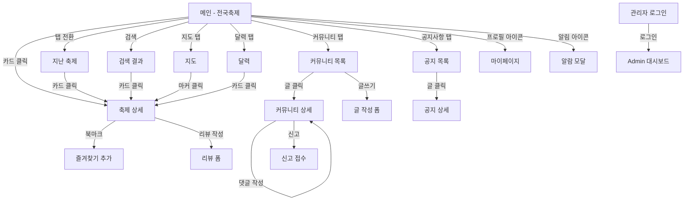

# 📐 화면 설계서 (Screen Design Document)

> **프로젝트**: 지역 축제 통합 정보 플랫폼 (이음)  
> **작성일**: 2026년 3월 27일  
> **작성자**: 이음 팀  
> **버전**: v1.0  
> **해상도 기준**: 1440px (데스크톱 웹)

---

## 1. 화면 목록 총괄

| 화면 번호 | 화면명 | 관련 API | 주요 기능 |
|---------|-------|---------|---------|
| 화면 1 | 전국 축제 메인 | API_FES_0001 | 탭(전체/진행중/진행전) + 검색 + 필터 + 카드 그리드 |
| 화면 2 | 축제 상세페이지 | API_FES_0002 | 상세설명 + 정보 + 별점/만족도 + 후기 |
| 화면 3 | 지도 탭 | API_FES_0004 | 카카오맵 + 클러스터링 + GPS + 축제 마커 |
| 화면 4 | 지난 축제 | API_FES_0001 (status=ENDED) | 검색 + 필터 + 종료 배지 카드 그리드 |
| 화면 5 | 달력 | API_FES_0005 | 월별 캘린더 + 축제 개수 배지 + 카드 리스트 |
| 화면 6 | 커뮤니티 - 자유게시판 | API_COM_0001 | 카테고리 필터 + 검색 + 테이블 목록 + 글쓰기 |
| 화면 7 | 커뮤니티 상세페이지 | API_COM_0002 | 제목 + 말머리 + 상세내용 + 댓글 + 수정/삭제/신고 |
| 화면 8~9 | 공지사항 (목록+상세) | API_NTC_0001~0002 | 검색 + 목록 + 상세 내용 |
| 화면 10 | 알람 모달 | - | 공지 팝업 + 알림 목록 (글/댓글/문의) |
| 화면 11 | 마이페이지 | API_USR_0001~0002 | 즐겨찾기/게시글/리뷰/댓글/알림설정/프로필 |
| 화면 12 | 관리자 (Admin) | API_ADM_0001~0018 | 사이드바 + 통계 대시보드 + CRUD 관리 |

---

## 2. 화면별 와이어프레임

---

### 화면 1. 전국 축제 메인

**레이아웃 구성:**
- **GNB (상단 네비게이션)**: 로고 "이음" + 메뉴탭 (전국축제/지난축제/달력/커뮤니티/공지사항) + 로그인/회원가입
- **탭 필터**: 전체 | 진행중 | 진행전 (활성 탭 하이라이트)
- **검색 + 필터**: 검색바 + 드롭다운 필터 버튼
- **카드 그리드**: 3열 × 3행 축제 카드 (이미지 + 축제명 + 기간 + 별점)
- **페이지네이션**: < 1 2 3 4 5 > + 리스트 목록 전환 토글

**관련 API:** `API_FES_0001` (GET /api/festivals)

**인터랙션:**
- 카드 클릭 → 화면 2 (축제 상세) 이동
- 탭 전환 → status 필터 변경 (전체/ONGOING/UPCOMING)
- 필터 버튼 → 지역/카테고리 드롭다운

---

### 화면 2. 축제 상세페이지

**레이아웃 구성 (2컬럼):**
- **좌측 (60%)**:
  - 대형 히어로 이미지
  - 축제명 + 기간 + 위치 + 북마크 아이콘
  - ① 상세 설명 섹션 (텍스트 + 이미지)
- **우측 (40%)**:
  - ④ 정보 박스 (위치, 기간, 문의처)
  - ② 별점/만족도 (평균 4.5 + 분포 차트)
- **하단 (전체 너비)**:
  - 후기 섹션: 사용자 아바타 + 닉네임 + 별점 + 리뷰 내용
  - ③ 목록 페이지 + 페이징 처리

**관련 API:** `API_FES_0002` (GET /api/festivals/{festivalId}), `API_REV_0001` (GET /api/reviews)

**인터랙션:**
- 북마크 아이콘 → `API_FES_0006` 즐겨찾기 추가
- "리뷰 작성" 버튼 → 리뷰 작성 폼 (ENDED 상태만)
- 페이지네이션 → 리뷰 목록 페이지 이동

---

### 화면 3. 지도 탭

**레이아웃 구성:**
- **좌측 사이드 패널**: 지역 필터 드롭다운 + 상태(진행중/진행전) + 축제 리스트
- **메인 영역**: 카카오맵 전체 화면
  - 클러스터 마커 (서울 15, 경기 12, 강원 8, 부산 5 등)
  - 개별 축제 핀 마커
  - GPS 위치 버튼 + 줌 컨트롤

**관련 API:** `API_FES_0004` (GET /api/festivals/map)

**인터랙션 시나리오:**
1. 지도 탭 클릭 → 세계지도에서 한반도로 줌인 애니메이션
2. 한반도 지도 표시 → 카카오맵 로드
3. 축제 마커 + 클러스터링 렌더링
4. 클러스터 클릭 → 줌인 + 하위 마커 표시
5. 개별 마커 클릭 → 축제 미리보기 팝업

---

### 화면 4. 지난 축제

**레이아웃 구성:**
- 화면 1과 동일한 구조 (검색 + 필터 + 3열 카드 그리드)
- 각 카드에 **"종료" 배지** 오버레이
- 리스트 목록 전환 토글 + 페이지네이션

**관련 API:** `API_FES_0001` (status=ENDED)

**인터랙션:**
- 카드 클릭 → 화면 2 (상세) 이동 (지난 축제도 동일 레이아웃)
- 종료된 축제에서 리뷰 작성 가능

---

### 화면 5. 달력

**레이아웃 구성:**
- **월 네비게이션**: ← 2026. 3 → (좌/우 화살표)
- **캘린더 그리드**: 일~토 7열, 각 날짜 셀에 축제 개수 배지 ("2개", "3개")
- **선택 날짜 하단**: 해당 날짜 축제 카드 가로 스크롤 (이미지 + 제목 + 기간)
- **하단 페이지네이션**: 21 22 23 ...

**관련 API:** `API_FES_0005` (GET /api/festivals/calendar)

**인터랙션:**
- 날짜 셀 클릭 → 해당 날짜 축제 카드 리스트 표시
- 축제 카드 클릭 → 화면 2 (상세) 이동
- 좌/우 화살표 → 월 이동

---

### 화면 6. 커뮤니티 - 자유게시판

**레이아웃 구성:**
- **카테고리 탭**: 전체 | Q&A | 축제꿀팁 | 먹거리 + 필터 버튼
- **검색바**: 검색어 입력
- **게시판 테이블**: 번호 | 제목 | 작성자 | 댓글수 | 조회수 | 작성일
- **페이지네이션**: < 1 2 3 4 5 >
- **글쓰기 버튼**: 우하단 플로팅 버튼

**관련 API:** `API_COM_0001` (GET /api/community/posts)

**인터랙션:**
- 게시글 행 클릭 → 화면 7 (상세) 이동
- 카테고리 탭 클릭 → boardType 필터 변경
- 글쓰기 버튼 → 글 작성 폼 (로그인 필요)

---

### 화면 7. 커뮤니티 상세페이지

**레이아웃 구성 (중앙 정렬, max-width 900px):**
- **상단 우측**: 수정 | 삭제 | 신고 버튼
- **게시글 헤더**: 제목 + 날짜/작성일/작성자 + 축제/지역/카테고리 태그
- **말머리 선택**: Q&A / 축제꿀팁 / 먹거리
- **본문 영역**: 상세 내용 텍스트
- **댓글 섹션**: 사용자 아바타 + 닉네임 + 댓글 내용 + 날짜 + 좋아요/싫어요/신고
- **댓글 입력**: 텍스트 입력 + "등록" 버튼

**관련 API:** `API_COM_0002~0007`, `API_RPT_0001`

**인터랙션:**
- 수정 → 글 편집 폼 (본인만)
- 삭제 → 확인 팝업 → 삭제 (본인만)
- 신고 → 신고 사유 입력 팝업

---

### 화면 8~9. 공지사항 (목록 + 상세)

**화면 8 (좌측) — 공지사항 목록:**
- 검색바 + 필터
- 테이블: 제목 | 등록일 | 작성자 | 조회수 | 정보
- 페이지네이션

**화면 9 (우측) — 공지사항 상세:**
- 제목 + 작성자/등록일/조회수/분류
- 상세 내용 텍스트 영역
- 첨부 파일 다운로드 링크
- 목록으로 | 다음글/이전글 버튼

**관련 API:** `API_NTC_0001` (목록), `API_NTC_0002` (상세)

---

### 화면 10. 알람 모달

**레이아웃 구성 (모달 오버레이):**
- **배경**: 메인 페이지 흐릿하게 처리
- **모달 (500px × 600px)**:
  - 헤더: "알림" + X 닫기 + 설정/프로필 아이콘
  - 공지사항 팝업 박스 (상단 배너)
  - 알림 리스트:
    - 📝 글 — 내 게시글에 새 반응 알림
    - ⚠️ 댓글 — 내 댓글에 답글 알림
    - 💬 문의 — 문의 답변 등록 알림
    - ❓ 문의 — 새 문의 등록 알림

**인터랙션:**
- 알림 항목 클릭 → 해당 페이지로 이동
- X 클릭 → 모달 닫기

---

### 화면 11. 마이페이지

**레이아웃 구성 (2컬럼):**
- **좌측 사이드바 (250px)**:
  - 사용자 프로필 (아바타 + 이름)
  - 메뉴: 즐겨찾기 목록(찜) / 내 게시글 / 내 리뷰 / 내 댓글 / 내 알림 설정 / 내 문의 / 프로필 수정 / 탈퇴
- **우측 콘텐츠**: 선택된 메뉴의 내용 표시 (기본 = 즐겨찾기 카드 그리드)

**관련 API:** `API_USR_0001~0002`, `API_FES_0006~0007`

**디자인 참고사항:**
- 링크 이동 시 글 수정, 삭제 가능
- 삭제 시 팝업 확인 및 댓글 숨김 처리
- 댓글단 타인 페이지에서도 간보이도록 처리

---

### 화면 12. 관리자 (Admin)

**레이아웃 구성 (2컬럼):**
- **좌측 사이드바 (250px, 다크)**:
  - 공공 축제 리스트 → 목록, 수동갱신, 숨김
  - 자체기획 → 목록, 수정, 삭제
  - 신고 → 목록, 처리
  - 공지 → 목록, 수정, 등록
  - 문의 → 목록, 처리
  - 통계 대시보드 (활성)
- **우측 콘텐츠 (대시보드 뷰)**:
  - 상단 3개 통계 카드: 전체 사용자 수 / 신규 리뷰 / 진행 중 축제 수
  - 라인 그래프: 사용자 유입 및 활동 추이
  - 막대 그래프: 지역별 축제 카테고리 분포

**관련 API:** `API_ADM_0001~0018`

---

## 3. 화면 흐름도

---

## 4. 공통 컴포넌트

| 컴포넌트 | 사용 화면 | 설명 |
|---------|---------|------|
| GNB (상단 네비) | 전체 | 로고 + 메뉴 + 로그인/프로필 |
| 검색바 | 화면 1, 4, 6, 8 | 텍스트 입력 + 돋보기 아이콘 |
| 필터 드롭다운 | 화면 1, 4, 6 | 지역/카테고리/상태 필터 |
| 축제 카드 | 화면 1, 4, 5, 11 | 이미지 + 축제명 + 기간 + 별점 |
| 페이지네이션 | 화면 1, 2, 4, 6, 8 | < 1 2 3 4 5 > |
| 모달 오버레이 | 화면 10 | 딤드 배경 + 중앙 팝업 |
| 사이드바 | 화면 11, 12 | 좌측 세로 네비게이션 |
| 댓글 컴포넌트 | 화면 7 | 아바타 + 닉네임 + 내용 + 액션 |
| 통계 카드 | 화면 12 | 숫자 + 라벨 + 변동률 |

---

> **문서 이력**
>
> | 버전 | 날짜 | 작성자 | 내용 |
> |------|------|-------|------|
> | v1.0 | 2026-03-27 | 이음 팀 | 최초 작성 (12개 화면 와이어프레임) |
