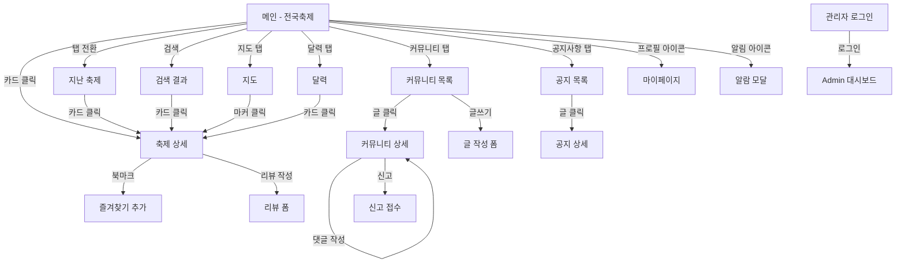

# 📐 화면 설계서 — 총괄 (Overview)

> **프로젝트**: 지역 축제 통합 정보 플랫폼 (이음)  
> **작성일**: 2026년 3월 27일  
> **해상도 기준**: 1440px (데스크톱 웹)

---

## 화면 목록

| 화면 번호 | 화면명 | 파일 | 관련 API | 주요 기능 |
|---------|-------|------|---------|---------|
| 화면 1 | 전국 축제 메인 | [01_전국축제_메인.md](01_전국축제_메인.md) | API_FES_0001 | 탭 + 검색 + 필터 + 카드 그리드 |
| 화면 2 | 축제 상세페이지 | [02_축제_상세.md](02_축제_상세.md) | API_FES_0002 | 상세설명 + 정보 + 별점 + 후기 |
| 화면 3 | 지도 탭 | [03_지도_탭.md](03_지도_탭.md) | API_FES_0004 | 카카오맵 + 클러스터링 + GPS |
| 화면 4 | 지난 축제 | [04_지난축제.md](04_지난축제.md) | API_FES_0001 | 종료 배지 + 카드 그리드 |
| 화면 5 | 달력 | [05_달력.md](05_달력.md) | API_FES_0005 | 월별 캘린더 + 축제 개수 배지 |
| 화면 6 | 커뮤니티 목록 | [06_커뮤니티_목록.md](06_커뮤니티_목록.md) | API_COM_0001 | 카테고리 + 검색 + 테이블 |
| 화면 7 | 커뮤니티 상세 | [07_커뮤니티_상세.md](07_커뮤니티_상세.md) | API_COM_0002 | 본문 + 댓글 + 수정/삭제/신고 |
| 화면 8~9 | 공지사항 | [08_공지사항.md](08_공지사항.md) | API_NTC_0001~0002 | 목록 + 상세 |
| 화면 10 | 알람 모달 | [10_알람_모달.md](10_알람_모달.md) | — | 공지 팝업 + 알림 리스트 |
| 화면 11 | 마이페이지 | [11_마이페이지.md](11_마이페이지.md) | API_USR_0001~0002 | 즐겨찾기/게시글/리뷰/프로필 |
| 화면 12 | 관리자 (Admin) | [12_관리자.md](12_관리자.md) | API_ADM_0001~0018 | 사이드바 + 대시보드 + CRUD |

---

## 화면 흐름도

---

## 공통 컴포넌트

| 컴포넌트 | 사용 화면 | 설명 |
|---------|---------|------|
| GNB (상단 네비) | 전체 | 로고 + 메뉴 + 로그인/프로필 |
| 검색바 | 1, 4, 6, 8 | 텍스트 입력 + 돋보기 아이콘 |
| 필터 드롭다운 | 1, 4, 6 | 지역/카테고리/상태 필터 |
| 축제 카드 | 1, 4, 5, 11 | 이미지 + 축제명 + 기간 + 별점 |
| 페이지네이션 | 1, 2, 4, 6, 8 | < 1 2 3 4 5 > |
| 모달 오버레이 | 10 | 딤드 배경 + 중앙 팝업 |
| 사이드바 | 11, 12 | 좌측 세로 네비게이션 |
| 댓글 컴포넌트 | 7 | 아바타 + 닉네임 + 내용 + 액션 |
| 통계 카드 | 12 | 숫자 + 라벨 + 변동률 |

---

> | 버전 | 날짜 | 작성자 | 내용 |
> |------|------|-------|------|
> | v1.0 | 2026-03-27 | 이음 팀 | 최초 작성 (12개 화면) |
