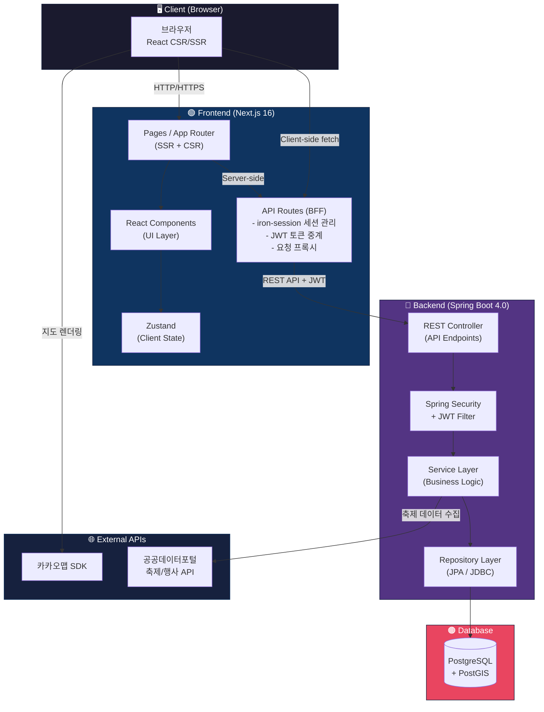
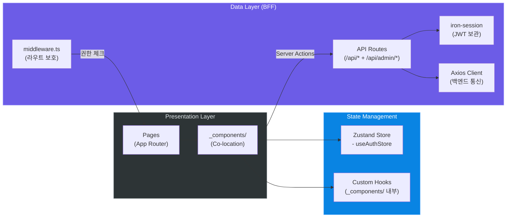
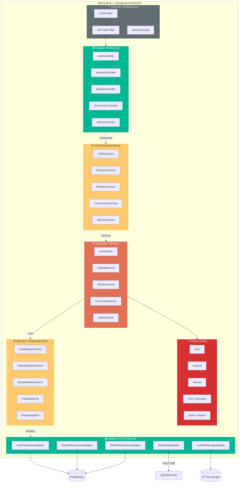
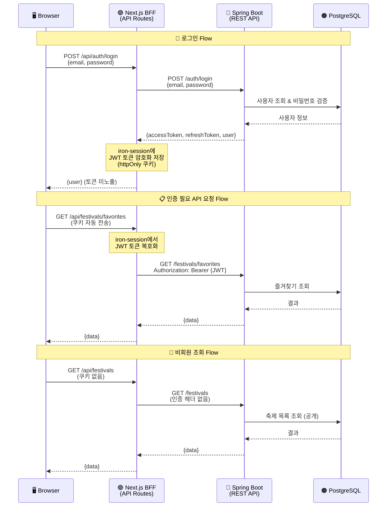
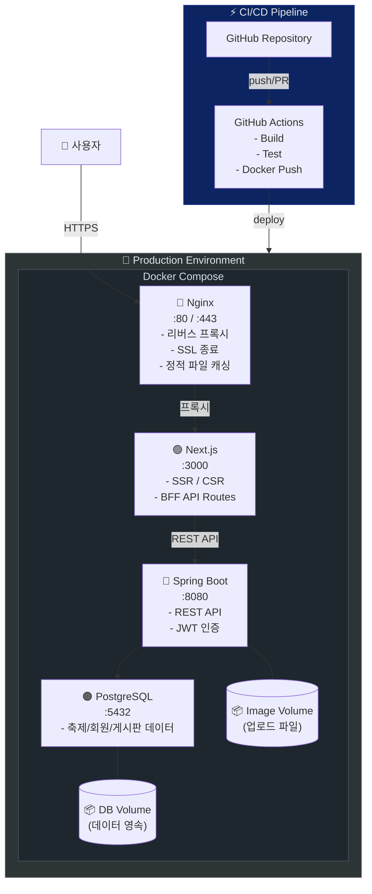
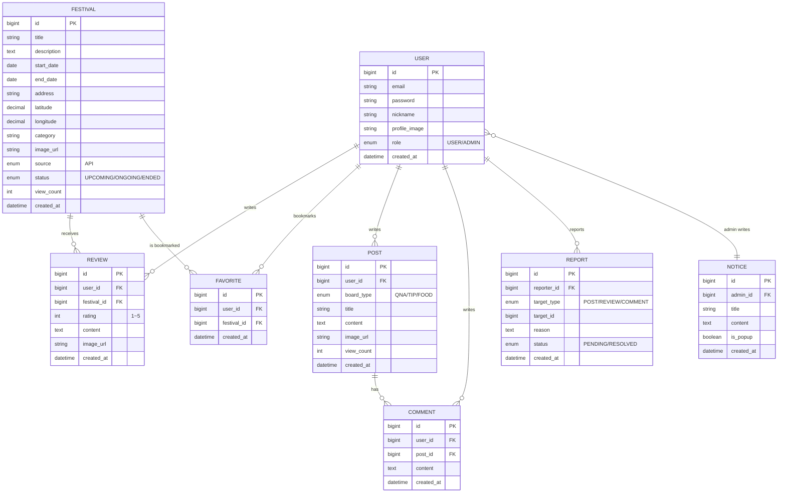

# 📋 1차 프로젝트 기획서

> **작성일**: 2026년 3월 25일  
> **팀명**: 이음 (IEUM)
> **팀원**: 박수경, 채나은, 정혜연, 황서범, 정우혁  
> **프로젝트 기간**: 2026년 3월 25일 ~ 2026년 4월 24일 (4주)

---

## 1. 🎯 프로젝트 개요

### 1-1. 프로젝트명
> **지역 축제 통합 정보 플랫폼**

### 1-2. 프로젝트 배경 및 동기
> 왜 이 프로젝트를 하고 싶은가? 어떤 문제를 해결하고 싶은가?

- 전국 각지에서 열리는 축제 정보가 지자체 홈페이지, 블로그, SNS 등에 **파편화**되어 있어 한눈에 파악하기 어려움
- 축제 일정·위치·후기 등을 **하나의 플랫폼에서 통합 조회**할 수 있는 서비스가 부재
- 비회원도 축제 정보를 자유롭게 조회하고, 회원은 후기·사진 공유 및 커뮤니티 소통 등 **사용자 참여형 콘텐츠**에 대한 수요 존재
- 공공데이터포털(`data.go.kr`)의 축제/행사 API를 활용하여 **실제 데이터 기반** 서비스 구현 가능

### 1-3. 프로젝트 목표
> 이 프로젝트가 완성되면 어떤 가치를 제공하는가?

- **핵심 목표**: 전국 축제 정보를 지도 기반으로 통합 제공하는 원스톱 정보 플랫폼 구축
- **세부 목표 1**: 카카오맵 API 연동을 통한 지도 기반 축제 위치 탐색 및 지역별 클러스터링 조회 기능 구현
- **세부 목표 2**: 비회원 조회 + 회원(방문객/관리자) 기반의 다중 권한 시스템 및 커뮤니티 기능 구현
- **세부 목표 3**: 지난 축제 후기·별점·베스트 포토 등 사용자 참여 콘텐츠 생태계 조성

### 1-4. 타겟 사용자
> 누가 이 서비스를 사용하는가?

| 사용자 유형 | 설명 | 주요 니즈 |
|------------|------|----------|
| 👀 비회원 | 로그인 없이 서비스를 이용하는 방문자 | 축제 정보 조회, 지도 탐색, 검색/필터링 (조회만 가능) |
| 🧑 회원 (방문객) | 회원가입한 일반 사용자 | 축제 정보 검색, 위치 탐색, 후기 작성, 즐겨찾기, 커뮤니티 참여 |
| ⚙️ 관리자 | 플랫폼 운영 관리자 | 축제 데이터 관리(공공 API 갱신), 사용자 신고 처리, 통계 확인 |

---

## 2. 💡 아이디어 브레인스토밍

> 

### 2-1. 프로젝트 주제 후보

| # | 주제 아이디어 | 장점 | 단점 | 난이도 (상/중/하) | 투표 |
|---|-------------|------|------|-----------------|------|
| 1 | 지역 축제 및 마켓 통합 정보 플랫폼 | 공공데이터 활용, 지도 연동 시각적 완성도 높음 | 지도 API 의존성, 데이터 수집 필요 | 중 | ✅ **채택** |

### 2-2. 자유 아이디어 메모
> 주제와 관련 없이 떠오르는 기능, 디자인, 기술 등 자유롭게 기록

- 지도에서 클러스터링으로 시/도별 축제 개수 표시
- 달력 뷰에서 축제 일정 한눈에 보기
- 축제 전용 오픈 채팅방 (실시간 현장 톡) → 2차 구현 예정
- GPS 기반 방문 인증 사진 업로드 & 베스트 포토 리뷰
- 주차/교통/반려동물 동반 관련 Q&A 게시판

---

## 3. 🔍 프로젝트 방향성

### 3-1. 핵심 컨셉 (한 줄 요약)
> **"전국 축제를 지도 위에서 발견하고, 후기로 나누는 통합 축제 정보 플랫폼"**

### 3-2. 차별화 포인트
> 기존 서비스와 다른 우리만의 특별한 점은?

1. **지도 기반 통합 탐색** — 지역별 클러스터링 + GPS 연동으로 내 주변 축제를 직관적으로 탐색
2. **다중 사용자 권한** — 비회원(조회) / 회원(참여) / 관리자(운영) 3종 역할을 구분하여 각각에 맞는 기능 제공
3. **축제 라이프사이클** — 진행 중(전·중) 축제와 지난 축제를 구분하여 정보 + 후기를 체계적으로 관리
4. **커뮤니티 기반 정보 공유** — Q&A, 꿀팁, 먹거리 정보 등 사용자 참여형 콘텐츠 생태계

### 3-3. 참고 서비스 / 벤치마킹
> 참고할 만한 기존 서비스나 사이트

| 서비스명 | URL | 참고할 점 | 개선할 점 |
|---------|-----|----------|----------|
| 대한민국 구석구석 (한국관광공사) | https://korean.visitkorea.or.kr | 축제/행사 정보 제공 구조 | 지도 기반 탐색 부족, 커뮤니티 부재 |
| 위메프 로컬/야놀자 | - | 지역 기반 행사 탐색 UX | 축제 특화 아님, 상업적 성격 강함 |
| 카카오맵 축제 검색 | https://map.kakao.com | 지도 UI, 클러스터링 패턴 | 축제 전용 필터/커뮤니티 없음 |
| 축제야놀자 | - | 축제 정보 집약 | UI/UX 노후, 모바일 미최적화 |

---

## 4. ⚙️ 주요 기능 정의

### 4-1. 필수 기능 (MVP)
> 프로젝트 기간 내 반드시 구현할 기능

| # | 기능명 | 설명 | 우선순위 | 담당자 |
|---|-------|------|---------|-------|
| 1 | 🗺️ **전국 축제 지도 탐색** | 카카오맵 API 연동, 시/도별 클러스터링 마커, GPS 기반 현재 위치 주변 탐색. 비회원도 조회 가능 | P1 | |
| 2 | 📋 **축제 목록 & 상세 조회** | 진행 중(전·중) 축제 목록, 상세 정보(일정/장소/소개/이미지) 표시. 비회원도 조회 가능 | P1 | |
| 3 | 🔍 **검색 & 필터링** | 지역별(시/도), 날짜별, 카테고리별 필터 + 키워드 검색. 비회원도 이용 가능 | P1 | |
| 4 | 🔐 **회원가입/로그인 (JWT)** | 다중 권한(회원/관리자), JWT 인증(Spring Security) + BFF 세션(iron-session), 프로필 관리 | P1 | |
| 5 | 📅 **달력 뷰** | 캘린더 형태로 축제 일정 조회, 개수에 따라 리스트/카드 형식 전환. 비회원도 조회 가능 | P1 | |
| 6 | 📝 **지난 축제 보기** | 종료된 축제 아카이브, 후기 기능, 회원 만족도(별점 평균) 표시. 비회원은 후기 열람만 가능 | P1 | |
| 7 | 💬 **커뮤니티 (게시판)** | Q&A 게시판(주차/교통/반려동물), 축제 꿀팁 공유(준비물 체크리스트), 먹거리 정보. 글 작성은 회원만 | P2 | |
| 8 | 👤 **마이페이지** | 즐겨찾기, 내 게시글/리뷰 관리, 프로필 수정(이미지/닉네임) | P2 | |
| 9 | ⚙️ **관리자 페이지** | 축제 데이터 관리(공공 API 수동 갱신), 사용자 신고관리, 공지/팝업 설정 | P2 | |
| 10 | 📢 **공지사항** | 서비스 공지, 관리자 작성 | P2 | |
| 11 | 📱 **반응형 웹 디자인** | 모바일/태블릿/데스크톱 대응 | P1 | |
| 12 | 📊 **관리자 통계 대시보드** | 지역별 축제 분포 현황, 사용자 유입/활동(리뷰/게시글) 추이 시각화 | P1 | |
| 13 | ⭐ **리뷰/별점 시스템** | 축제별 리뷰 & 별점 남기기, 만족도 평균 표시. 지난 축제 보기와 연동 | P2 | |
| 14 | 📋 **설문 조사 관리** | 관리자가 설문 생성, 사용자 참여/결과 집계 | P2 | |

### 4-2. 추가 기능 (Nice to Have)
> 시간이 남으면 구현하고 싶은 기능

| # | 기능명 | 설명 | 비고 |
|---|-------|------|------|
| 1 | 📸 방문 인증 게시판 | GPS 기반 방문 인증 사진 업로드, 베스트 포토 리뷰(추천수 기반) | 사진 업로드 + GPS 검증 필요 |

### 4-3. 제외 기능
> 범위 밖으로 정한 기능 (왜 제외했는지도 기록)

| 기능 | 제외 사유 |
|------|----------|
| 🚫 실시간 현장 톡 (오픈 채팅방) | WebSocket 구현 + 채팅 UI + 메시지 저장 인프라 필요, 2차 구현으로 후순위 |
| 🚫 현장 혼잡도 표시 | 실시간 데이터 수집 인프라(IoT/GPS 집계) 필요, 신뢰성 있는 데이터 확보 불가 |
| 🚫 푸시 알림 (관심 축제 알림) | FCM 연동 + 알림 서버 구축 필요, 마이페이지 내 알림 목록으로 간소화 대체 가능 |
| 🚫 온라인 결제 / 티켓 시스템 | PG사 연동(사업자 등록 필요) + 결제/취소/환불 플로우 복잡 |
| 🚫 AI 기반 축제 추천 | 추천 학습 데이터 부족, 인기순/조회순 정렬로 대체 |
| 🚫 네이티브 모바일 앱 | 반응형 웹으로 대체, 별도 빌드 파이프라인 부담 |

---

## 5. 🛠️ 기술 스택

### 5-1. 프론트엔드

| 항목 | 기술 / 버전 | 선택 이유 |
|------|------------|----------|
| 프레임워크 | **Next.js 16.1.6** | React 기반 SSR/SSG 지원, API Routes로 BFF 패턴 구현, SEO 최적화 |
| UI 라이브러리 | **React 19.2.4** | 컴포넌트 기반 UI, 풍부한 생태계, Server Components 지원 |
| 언어 | **TypeScript 5.x** | 타입 안전성, 개발 생산성 향상, 런타임 오류 사전 방지 |
| 인증 (BFF) | **iron-session 8.0.4** | 서버 측 세션 관리, Next.js API Routes와 통합하여 JWT를 안전하게 관리 |
| 스타일링 | **CSS Modules** | 컴포넌트 단위 스코프 격리, 클래스명 충돌 방지, 별도 설정 불필요 |
| 상태관리 | **Zustand** | 경량, 직관적 API, 러닝커브 낮음 |
| 🗺️ 지도 | **Kakao Maps SDK** (`react-kakao-maps-sdk`) | 국내 주소 체계 최적화, 무료 일 30만 건, React 래퍼 존재 |
| 📅 캘린더 | **FullCalendar** | 다양한 뷰(월/주/일) 지원, 이벤트 관리 기능 풍부, 달력 뷰 구현용 |
| HTTP 통신 | **Axios** | REST API 통신 표준 |

### 5-2. 백엔드

| 항목 | 기술 / 버전 | 선택 이유 |
|------|------------|----------|
| 언어 | **Java 21** | LTS 버전, Virtual Threads 등 최신 기능 활용 |
| 프레임워크 | **Spring Boot 4.0.1** | 최신 안정 버전, REST API 개발 표준 |
| 인증/인가 | **Spring Security + JWT** | REST API 인증 표준, 다중 권한(회원/관리자) 처리 |
| 데이터베이스 | **PostgreSQL** (JDBC 드라이버 42.7.9) | 고급 쿼리 지원, JSON 타입, 공간 데이터(PostGIS) 확장 가능 |
| API 문서 | **Swagger (OpenAPI 3.0)** | 자동 문서화, 프론트-백 협업 효율 |
| 파일 업로드 | **Docker Volume (로컬 저장)** | 리뷰 사진, 프로필 이미지 저장. 컨테이너 재시작에도 데이터 영속 |
| 공공데이터 | **data.go.kr 축제/행사 API** | 전국 축제 데이터 수집 |

### 5-3. 인프라 / DevOps

| 항목 | 기술 | 선택 이유 |
|------|------|----------|
| 컨테이너 | **Docker Compose** | 멀티 컨테이너 오케스트레이션 (프론트 + 백엔드 + DB 통합 관리) |
| 리버스 프록시 | **Nginx** | 프론트엔드 앞단 리버스 프록시, 정적 파일 서빙, SSL 처리 |
| CI/CD | **GitHub Actions** | GitHub 연동, 자동 빌드/테스트/배포 파이프라인 |
| 배포 | **Docker Compose** | 컨테이너 기반 배포, 프론트/백엔드/DB 통합 관리 |

---

## 6. 🏗️ 시스템 아키텍처

### 6-1. 전체 시스템 아키텍처

> **BFF(Backend For Frontend) 패턴** 기반의 3-Tier 아키텍처



### 6-2. 프론트엔드 아키텍처 (Next.js)

> App Router + **Co-location 패턴** + BFF 패턴
>
> 핵심 원칙: 각 라우트 폴더 안에 `_components/`를 두고, 컴포넌트·CSS Module·커스텀 훅이 같은 폴더에 공존

```
📁 frontend/src/
├── 📁 app/
│   ├── globals.css                          # 글로벌 스타일 (리셋, CSS 변수, 폰트)
│   ├── layout.tsx                           # 루트 레이아웃
│   ├── layout.module.css
│   ├── page.tsx                             # 🏠 메인 (랜딩)
│   ├── page.module.css
│   ├── 📁 _components/                      # 메인 페이지 전용
│   │   ├── 📁 HeroBanner/
│   │   │   ├── HeroBanner.tsx
│   │   │   └── HeroBanner.module.css
│   │   └── 📁 PopularFestivals/
│   │       ├── PopularFestivals.tsx
│   │       └── PopularFestivals.module.css
│   │
│   ├── 📁 (user)/                           # ─── 🧑 사용자 그룹 레이아웃 ───
│   │   ├── layout.tsx                       # 사용자 레이아웃 (GNB + Footer)
│   │   ├── layout.module.css
│   │   ├── 📁 _components/                  # 레이아웃 공통
│   │   │   ├── 📁 UserHeader/               # GNB
│   │   │   └── 📁 UserFooter/
│   │   │
│   │   ├── 📁 festivals/                    # 🗺️ 전국 축제
│   │   │   ├── page.tsx / page.module.css
│   │   │   ├── 📁 _components/
│   │   │   │   ├── 📁 FestivalMap/          # .tsx + .module.css + useFestivalMap.ts
│   │   │   │   ├── 📁 ClusterMarker/
│   │   │   │   ├── 📁 FestivalCard/
│   │   │   │   └── 📁 SearchFilter/         # .tsx + .module.css + useSearchFilter.ts
│   │   │   └── 📁 [id]/                     # 축제 상세
│   │   │       ├── page.tsx / page.module.css
│   │   │       └── 📁 _components/
│   │   │           ├── 📁 FestivalDetail/
│   │   │           ├── 📁 LocationMap/
│   │   │           ├── 📁 ReviewSection/    # .tsx + .module.css + useReviews.ts
│   │   │           └── 📁 ImageGallery/
│   │   │
│   │   ├── 📁 past-festivals/              # 📜 지난 축제
│   │   ├── 📁 calendar/                     # 📅 달력 뷰
│   │   ├── 📁 community/                    # 💬 커뮤니티 (write/, [id]/ 포함)
│   │   ├── 📁 notices/                      # 📢 공지사항 (조회)
│   │   └── 📁 mypage/                       # 👤 마이페이지
│   │
│   ├── 📁 auth/                             # 🔐 인증
│   │   ├── 📁 login/                        # page.tsx + _components/LoginForm/
│   │   └── 📁 register/                     # page.tsx + _components/RegisterForm/
│   │
│   ├── 📁 admin/                            # ─── ⚙️ 관리자 그룹 ───
│   │   ├── layout.tsx / layout.module.css
│   │   ├── 📁 _components/                  # AdminSidebar/, AdminTopbar/
│   │   ├── page.tsx                         # 📊 대시보드
│   │   ├── 📁 festivals/                    # 축제 관리 (sync/ 포함)
│   │   ├── 📁 reports/                      # 🚨 신고 관리
│   │   ├── 📁 notices/                      # 📢 공지 CRUD
│   │   ├── 📁 statistics/                   # 📊 통계
│   │   ├── 📁 surveys/                      # 📋 설문
│   │   └── 📁 users/                        # 👥 사용자 관리
│   │
│   └── 📁 api/                              # ★ BFF API Routes
│       ├── 📁 auth/                         # → backend /api/auth/*
│       │   ├── login/route.ts
│       │   ├── logout/route.ts
│       │   ├── register/route.ts
│       │   └── me/route.ts
│       ├── 📁 festivals/route.ts            # → backend /api/festivals
│       ├── 📁 reviews/route.ts              # → backend /api/reviews
│       ├── 📁 favorites/route.ts            # → backend /api/favorites
│       ├── 📁 community/                    # → backend /api/community/*
│       ├── 📁 notices/route.ts              # GET only
│       ├── 📁 reports/route.ts              # POST only
│       └── 📁 admin/                        # → backend /api/admin/*
│           ├── auth/, festivals/, reports/
│           ├── notices/, statistics/
│           ├── surveys/, users/
│           └── (관리자 전용 BFF 프록시)
│
├── 📁 _shared/                              # 🔗 여러 라우트에서 재사용하는 공통 컴포넌트
│   ├── 📁 Pagination/                       # .tsx + .module.css
│   ├── 📁 StarRating/
│   ├── 📁 Modal/
│   ├── 📁 ConfirmDialog/
│   └── 📁 DataTable/                        # 관리자 테이블 공통
│
├── 📁 lib/
│   ├── session.ts                           # iron-session 설정
│   ├── api.ts                               # /api/* Axios 인스턴스
│   └── adminApi.ts                          # /api/admin/* Axios 인스턴스
│
├── 📁 stores/                               # Zustand (전역 상태만)
│   └── useAuthStore.ts                      # role(USER/ADMIN) 통합 관리
│
├── 📁 types/                                # TypeScript 타입 정의
│
└── middleware.ts                             # ★ 라우트 보호
    # /admin/* → ADMIN role 체크
    # /mypage, /community/write → USER role 체크
    # 비회원 허용 경로 → 통과
```



### 6-3. 백엔드 아키텍처 (Spring Boot — Hexagonal Architecture)

> **헥사고날 아키텍처 (포트 & 어댑터)** + Spring Security JWT 필터 체인
>
> 핵심 원칙: **도메인이 중심**, 외부 기술(DB, API, Web)은 어댑터로 분리하여 의존성이 항상 안쪽(도메인)으로 향함

```
📁 backend/src/main/java/com/ieum/festival/

### 계층 구조 (각 도메인 Context 예시)

{context}/
├── adapter/
│   ├── in/web/                       ← [Driving Adapter] 입구. @RestController 및 Request/Response DTO
│   └── out/persistence/              ← [Driven Adapter] 출구. Port 구현체
│       ├── entity/                   ← JPA @Entity 클래스 (DB 매핑 전용)
│       └── repository/               ← Spring Data JPA Repository 인터페이스
├── application/
│   ├── port/
│   │   ├── in/                       ← [Input Port] UseCase 인터페이스 및 Command 객체
│   │   └── out/                      ← [Output Port] Load/Save Port 인터페이스
│   ├── result/                       ← [Application Result] 서비스 반환 데이터 포맷
│   └── service/                      ← [Application Service] 비즈니스 로직 구현체
└── domain/
    └── model/                        ← [Domain Model] 핵심 비즈니스 규칙을 담은 순수 객체
```

```
### 전체 패키지 구조 — shared / user / admin / global 분리

📁 com.ieum.festival/
│
├── 📁 shared/                                 # 🔗 공유 도메인 (user/admin 양쪽에서 import)
│   └── 📁 domain/
│       └── 📁 model/
│           ├── Festival.java                  # 양쪽에서 동일 테이블 접근
│           ├── FestivalStatus.java            # enum: UPCOMING / ONGOING / ENDED
│           ├── Notice.java
│           └── Report.java
│
├── 📁 user/                                   # 👤 일반 사용자 서비스 영역
│   │
│   ├── 📁 festival/                           # 🎪 축제 (★ 조회 전용)
│   │   ├── 📁 adapter/
│   │   │   ├── 📁 in/web/                     ← [Driving Adapter]
│   │   │   │   ├── FestivalController.java    ← @RestController (GET /api/festivals/**)
│   │   │   │   ├── FestivalRequest.java
│   │   │   │   └── FestivalResponse.java
│   │   │   └── 📁 out/persistence/            ← [Driven Adapter]
│   │   │       ├── 📁 entity/
│   │   │       │   └── FestivalJpaEntity.java
│   │   │       ├── 📁 repository/
│   │   │       │   └── FestivalJpaRepository.java
│   │   │       └── FestivalPersistenceAdapter.java ← implements LoadFestivalPort
│   │   ├── 📁 application/
│   │   │   ├── 📁 port/
│   │   │   │   ├── 📁 in/                     ← [Input Port]
│   │   │   │   │   ├── GetFestivalListUseCase.java
│   │   │   │   │   ├── GetFestivalDetailUseCase.java
│   │   │   │   │   ├── SearchFestivalByMapUseCase.java
│   │   │   │   │   └── GetFestivalByCalendarUseCase.java
│   │   │   │   └── 📁 out/                    ← [Output Port] 읽기만
│   │   │   │       └── LoadFestivalPort.java
│   │   │   ├── 📁 result/
│   │   │   │   ├── FestivalListResult.java
│   │   │   │   └── FestivalDetailResult.java
│   │   │   └── 📁 service/
│   │   │       └── FestivalQueryService.java  ← 조회 전용
│   │   └── 📁 domain/                         ← shared/domain/model/Festival 사용
│   │
│   ├── 📁 auth/                               # 🔐 인증 도메인
│   │   ├── 📁 adapter/
│   │   │   ├── 📁 in/web/
│   │   │   │   ├── AuthController.java        ← /api/auth/**
│   │   │   │   ├── UserController.java        ← /api/profile/**
│   │   │   │   ├── LoginRequest.java
│   │   │   │   └── UserResponse.java
│   │   │   └── 📁 out/persistence/
│   │   │       ├── 📁 entity/
│   │   │       │   └── UserJpaEntity.java
│   │   │       ├── 📁 repository/
│   │   │       │   └── UserJpaRepository.java
│   │   │       └── UserPersistenceAdapter.java
│   │   ├── 📁 application/
│   │   │   ├── 📁 port/
│   │   │   │   ├── 📁 in/
│   │   │   │   │   ├── LoginUseCase.java
│   │   │   │   │   ├── RegisterUseCase.java
│   │   │   │   │   ├── GetUserProfileUseCase.java
│   │   │   │   │   └── UpdateUserProfileUseCase.java
│   │   │   │   └── 📁 out/
│   │   │   │       ├── LoadUserPort.java
│   │   │   │       ├── SaveUserPort.java
│   │   │   │       └── PasswordEncoderPort.java
│   │   │   ├── 📁 result/
│   │   │   │   └── AuthResult.java
│   │   │   └── 📁 service/
│   │   │       ├── AuthService.java
│   │   │       └── UserProfileService.java
│   │   └── 📁 domain/
│   │       └── 📁 model/
│   │           ├── User.java
│   │           └── Role.java                  ← enum: USER / ADMIN
│   │
│   ├── 📁 review/                             # ⭐ 리뷰/별점 (CRUD)
│   │   ├── 📁 adapter/ (in/web/ → /api/reviews/**, out/persistence/)
│   │   ├── 📁 application/ (port/, result/, service/)
│   │   └── 📁 domain/model/
│   │       └── Review.java
│   │
│   ├── 📁 favorite/                           # ❤️ 즐겨찾기 (CRUD)
│   │   ├── 📁 adapter/ (in/web/ → /api/favorites/**, out/persistence/)
│   │   ├── 📁 application/ (port/, result/, service/)
│   │   └── 📁 domain/model/
│   │       └── Favorite.java
│   │
│   ├── 📁 community/                          # 💬 커뮤니티 도메인 (CRUD)
│   │   ├── 📁 adapter/ (in/web/ → /api/community/**, out/persistence/)
│   │   ├── 📁 application/ (port/, result/, service/)
│   │   └── 📁 domain/model/
│   │       ├── Post.java
│   │       ├── Comment.java
│   │       └── BoardType.java                 ← enum: QNA / TIP / FOOD
│   │
│   ├── 📁 notice/                             # 📢 공지사항 (★ 조회만)
│   │   ├── 📁 adapter/ (in/web/ → GET /api/notices/** only)
│   │   ├── 📁 application/ (port/in/ → GetNoticeList, GetNoticeDetail만)
│   │   └── 📁 domain/                         ← shared/domain/model/Notice 사용
│   │
│   └── 📁 report/                             # 🚨 신고 (★ 접수만)
│       ├── 📁 adapter/ (in/web/ → POST /api/reports only)
│       ├── 📁 application/ (port/in/ → CreateReportUseCase만)
│       └── 📁 domain/                         ← shared/domain/model/Report 사용
│
├── 📁 admin/                                  # ⚙️ 관리자 전용 서비스 영역
│   │
│   ├── 📁 festival-mgmt/                      # 🎪 축제 데이터 관리 (조회 + 공공API 갱신)
│   │   ├── 📁 adapter/
│   │   │   ├── 📁 in/web/
│   │   │   │   ├── FestivalAdminController.java ← /api/admin/festivals/**
│   │   │   │   └── SyncFestivalRequest.java
│   │   │   └── 📁 out/
│   │   │       ├── 📁 persistence/            ← DB 연동
│   │   │       └── 📁 external/               ← 외부 API 연동
│   │   │           └── PublicDataAdapter.java  ← implements PublicDataPort (공공데이터 API)
│   │   ├── 📁 application/
│   │   │   ├── 📁 port/
│   │   │   │   ├── 📁 in/
│   │   │   │   │   ├── GetFestivalAdminListUseCase.java
│   │   │   │   │   ├── SyncPublicDataUseCase.java
│   │   │   │   │   └── UpdateFestivalStatusUseCase.java
│   │   │   │   └── 📁 out/
│   │   │   │       ├── LoadFestivalPort.java
│   │   │   │       ├── SaveFestivalPort.java
│   │   │   │       └── PublicDataApiPort.java
│   │   │   ├── 📁 result/
│   │   │   │   └── SyncResult.java
│   │   │   └── 📁 service/
│   │   │       ├── FestivalAdminQueryService.java
│   │   │       └── FestivalAdminCommandService.java
│   │   └── 📁 domain/                         ← shared/domain/model/Festival 사용
│   │
│   ├── 📁 admin-auth/                         # 🔐 관리자 인증
│   │   ├── 📁 adapter/ (in/web/ → /api/admin/auth/**, out/persistence/)
│   │   ├── 📁 application/ (port/, result/, service/)
│   │   └── 📁 domain/model/
│   │       └── Admin.java
│   │
│   ├── 📁 report-mgmt/                        # 🚨 신고 관리 (목록 + 처리)
│   │   ├── 📁 adapter/ (in/web/ → /api/admin/reports/**, out/persistence/)
│   │   ├── 📁 application/ (port/, result/, service/)
│   │   └── 📁 domain/                         ← shared/domain/model/Report 사용
│   │
│   ├── 📁 notice-mgmt/                        # 📢 공지사항 관리 (CRUD 전체)
│   │   ├── 📁 adapter/ (in/web/ → /api/admin/notices/**, out/persistence/)
│   │   ├── 📁 application/ (port/, result/, service/)
│   │   └── 📁 domain/                         ← shared/domain/model/Notice 사용
│   │
│   ├── 📁 statistics/                         # 📊 통계 대시보드
│   │   ├── 📁 adapter/
│   │   │   ├── 📁 in/web/
│   │   │   │   ├── StatisticsController.java  ← /api/admin/statistics/**
│   │   │   │   └── StatsResponse.java
│   │   │   └── 📁 out/persistence/
│   │   ├── 📁 application/
│   │   │   ├── 📁 port/ (in/, out/)
│   │   │   ├── 📁 result/
│   │   │   │   ├── RegionStatsResult.java     ← 지역별 축제 분포
│   │   │   │   └── UserActivityResult.java    ← 사용자 활동 추이
│   │   │   └── 📁 service/
│   │   └── 📁 domain/model/
│   │
│   ├── 📁 survey/                             # 📋 설문 조사 관리
│   │   ├── 📁 adapter/ (in/web/ → /api/admin/surveys/**, out/persistence/)
│   │   ├── 📁 application/ (port/, result/, service/)
│   │   └── 📁 domain/model/
│   │       ├── Survey.java
│   │       ├── SurveyQuestion.java
│   │       └── SurveyResponse.java
│   │
│   └── 📁 user-mgmt/                         # 👥 사용자 관리
│       ├── 📁 adapter/ (in/web/ → /api/admin/users/**, out/persistence/)
│       ├── 📁 application/ (port/, result/, service/)
│       └── 📁 domain/model/
│           └── ManagedUser.java
│
└── 📁 global/                                 # 🔷 공통 인프라 (user/admin 모두 공유)
    ├── 📁 config/
    │   ├── SecurityConfig.java                # ★ URL 패턴별 권한 설정
    │   │   # /api/auth/** → permitAll
    │   │   # /api/festivals/** GET → permitAll
    │   │   # /api/notices/** GET → permitAll
    │   │   # /api/community/** GET → permitAll
    │   │   # /api/reviews/** POST → authenticated (USER)
    │   │   # /api/favorites/** → authenticated (USER)
    │   │   # /api/admin/** → hasRole(ADMIN)
    │   ├── WebConfig.java                     # CORS 설정
    │   └── SwaggerConfig.java                 # OpenAPI 3.0 (user/admin 그룹 분리)
    ├── 📁 security/
    │   ├── JwtTokenProvider.java              # JWT 생성/검증 (role 포함)
    │   ├── JwtAuthenticationFilter.java       # 요청마다 JWT 검증
    │   └── CustomUserDetailsService.java
    ├── 📁 exception/
    │   ├── GlobalExceptionHandler.java
    │   ├── BusinessException.java
    │   └── ErrorCode.java
    └── 📁 response/
        └── ApiResponse.java                   # 공통 응답 포맷 { success, data, error }
```



> **의존성 규칙 (Dependency Rule)**
>
> ```
> Adapter IN → Port IN → Application (Service) → Domain ← Application → Port OUT ← Adapter OUT
>   🟢              🟡           🟡                 🔴           🟡              🟡           🟢
>  (외부)        (인터페이스)    (유스케이스)        (핵심)       (유스케이스)    (인터페이스)     (외부)
> ```
>
> - **Domain**: 순수 Java 객체, 프레임워크 의존성 없음 (`@Entity` 미사용)
> - **Port**: 인터페이스만 정의, 구현은 Adapter에서
> - **Adapter IN**: Controller가 UseCase 인터페이스를 호출
> - **Adapter OUT**: JPA Entity/Repository가 Port 인터페이스를 구현

### 6-4. 인증 플로우 (JWT + BFF)

> 클라이언트 ↔ BFF(Next.js API Routes) ↔ 백엔드(Spring Boot) 인증 흐름



### 6-5. 인프라 / 배포 아키텍처

> Docker Compose 기반 컨테이너 오케스트레이션



```yaml
# docker-compose.yml (구조 예시)
services:
  nginx:        # 리버스 프록시
    ports: ["80:80", "443:443"]
    depends_on: [frontend]

  frontend:     # Next.js
    build: ./frontend
    ports: ["3000:3000"]
    depends_on: [backend]

  backend:      # Spring Boot
    build: ./backend
    ports: ["8080:8080"]
    depends_on: [database]
    volumes: [upload-data:/app/uploads]

  database:     # PostgreSQL
    image: postgres:17
    ports: ["5432:5432"]
    volumes: [pg-data:/var/lib/postgresql/data]

volumes:
  pg-data:       # DB 데이터 영속
  upload-data:   # 업로드 파일 영속
```

### 6-6. 주요 아키텍처 결정 사항 (ADR)

| # | 결정 사항 | 선택지 | 결정 | 근거 |
|---|----------|-------|------|------|
| 1 | 백엔드 아키텍처 | **Layered** vs **Hexagonal** vs Clean | Hexagonal | 도메인 중심 설계로 외부 기술(DB, API) 교체 용이, Port/Adapter로 테스트 용이, 확장성 확보 |
| 2 | 인증 방식 | 쿠키 직접 전달 vs **BFF 패턴** | BFF | JWT를 클라이언트에 노출하지 않아 XSS 공격 방지, iron-session으로 암호화 |
| 3 | 렌더링 전략 | CSR vs SSR vs **하이브리드** | 하이브리드 | SEO 필요 페이지(메인/축제 상세)는 SSR, 인터랙티브 페이지(지도/마이페이지)는 CSR |
| 4 | 상태 관리 | Redux vs Zustand vs **Context** | Zustand | 러닝커브 낮고, 보일러플레이트 최소, 소규모 프로젝트에 적합 |
| 5 | DB 선택 | MySQL vs **PostgreSQL** | PostgreSQL | PostGIS 확장으로 공간 쿼리(축제 위치 반경 검색) 가능, JSON 타입 지원 |
| 6 | 파일 저장 | S3 vs **Docker Volume** | Docker Volume | 별도 클라우드 비용 없이 로컬 영속 저장, 프로젝트 규모에 적합 |
| 7 | API 문서화 | Postman vs **Swagger** | Swagger | 코드 기반 자동 생성, 프론트-백 실시간 동기화 |

---

## 7. 📐 화면 설계 (와이어프레임)

### 7-1. 주요 화면 목록

| # | 화면명 | 설명 | 비고 |
|---|-------|------|------|
| 1 | 🏠 **메인 페이지** | 상단 GNB(전국축제/지난축제/달력/실시간현장/커뮤니티/공지), 인기 축제 하이라이트 | 랜딩 페이지 역할 |
| 2 | 🔐 **로그인/회원가입** | JWT 인증, 회원 가입 (비회원은 조회만 가능) | |
| 3 | 🗺️ **전국 축제 (지도 탐색)** | 카카오맵 전체 화면, 시/도별 클러스터링 마커, GPS 현재 위치 버튼, 필터 사이드바 | 핵심 화면 |
| 4 | 📋 **축제 상세** | 축제명, 기간, 장소, 설명, 이미지 갤러리, 위치 지도, 후기/별점 | |
| 5 | 📅 **달력 뷰** | 월별 캘린더 + 해당 날짜 축제 리스트/카드 표시 | 개수에 따라 형식 전환 |
| 6 | 📜 **지난 축제 보기** | 종료 축제 목록, 만족도(별점 평균) 표시, 후기 목록 | |
| 7 | 💬 **커뮤니티** | 탭: Q&A / 축제 꿀팁 / 먹거리, 게시글 CRUD | |
| 8 | 👤 **마이페이지** | 즐겨찾기, 내 게시글, 내 리뷰, 프로필 수정 | |
| 9 | ⚙️ **관리자 대시보드** | 축제 데이터 관리(공공 API 갱신), 사용자 신고관리, 공지/팝업 설정 | 관리자 전용 |
| 10 | 📊 **통계 대시보드** | 지역별 축제 분포 현황, 사용자 유입/활동 추이 시각화 | 관리자 전용, 필수 |
| 10 | 📢 **공지사항** | 공지 목록 및 상세 | |

### 7-2. 화면 흐름도 (User Flow)
> 사용자가 서비스를 어떻게 사용하는지 흐름을 정리

```
[비회원 Flow] — 조회만 가능
메인 페이지 → 전국 축제(지도 탐색) → 축제 상세 (조회만)
           ├→ 지난 축제 보기 → 축제 상세 → 후기 열람 (작성 불가)
           ├→ 달력 → 날짜별 축제 조회 → 축제 상세
           ├→ 커뮤니티 → Q&A / 꿀팁 / 먹거리 → 글 열람 (작성 불가)
           ├→ 공지사항 → 공지 상세
           └→ 회원가입/로그인 (글 작성·즐겨찾기 등 시도 시 로그인 유도)

[회원(방문객) Flow] — 조회 + 참여 기능
메인 페이지 → 회원가입/로그인 → 전국 축제(지도 탐색) → 축제 상세 → 즐겨찾기 추가
                              │                       └→ 후기/별점 작성
                              ├→ 지난 축제 보기 → 축제 상세 → 후기 열람/작성
                              ├→ 달력 → 날짜별 축제 조회 → 축제 상세
                              ├→ 커뮤니티 → Q&A / 꿀팁 / 먹거리 → 글 작성/댓글
                              ├→ 공지사항 → 공지 상세
                              └→ 마이페이지 → 즐겨찾기 / 내 게시글 / 프로필 수정

[관리자 Flow]
관리자 로그인 → 관리자 대시보드 → 축제 데이터 관리 (공공 API 수동 갱신)
                               ├→ 운영관리 (사용자 신고관리 / 공지·팝업 설정 / 설문 조사)
                               └→ 통계 대시보드 (지역별 분포 / 사용자 활동 추이)
```

---

## 8. 📊 데이터 설계 (ERD 초안)

### 8-1. 주요 엔티티(테이블) 목록

| # | 엔티티명 | 설명 | 주요 속성 |
|---|---------|------|----------|
| 1 | **User** | 사용자 정보 | id, email, password, nickname, profile_image, role(USER/ADMIN), created_at |
| 2 | **Festival** | 축제 정보 | id, title, description, start_date, end_date, address, latitude, longitude, category, image_url, source(API), status(UPCOMING/ONGOING/ENDED), view_count, created_at |
| 3 | **Review** | 축제 후기/별점 | id, user_id(FK), festival_id(FK), rating(1~5), content, image_url, created_at |
| 4 | **Favorite** | 즐겨찾기 | id, user_id(FK), festival_id(FK), created_at |
| 5 | **Post** | 커뮤니티 게시글 | id, user_id(FK), board_type(QNA/TIP/FOOD), title, content, image_url, view_count, created_at |
| 6 | **Comment** | 게시글 댓글 | id, user_id(FK), post_id(FK), content, created_at |
| 7 | **Notice** | 공지사항 | id, admin_id(FK), title, content, is_popup, created_at |
| 8 | **Report** | 신고 | id, reporter_id(FK), target_type(POST/REVIEW/COMMENT), target_id, reason, status(PENDING/RESOLVED), created_at |

### 8-2. 엔티티 관계
> 테이블 간의 관계를 간단히 정리



- User `1:N` Review — 한 사용자가 여러 후기 작성
- User `1:N` Favorite — 한 사용자가 여러 축제 즐겨찾기
- User `1:N` Post — 한 사용자가 여러 게시글 작성
- User `1:N` Comment — 한 사용자가 여러 댓글 작성
- Festival `1:N` Review — 한 축제에 여러 후기
- Festival `1:N` Favorite — 한 축제를 여러 사용자가 즐겨찾기
- Post `1:N` Comment — 한 게시글에 여러 댓글
- User `1:N` Report — 한 사용자가 여러 신고 가능

---

## 9. 👥 역할 분담

> 5인 팀 기준 (팀 미팅에서 확정 필요)

| 팀원 | 역할 | 담당 영역 | 비고 |
|------|------|----------|------|
| (팀원 A) | 팀장 / 프론트엔드 | 메인 페이지, 지도 연동(카카오맵), 반응형 레이아웃 | 지도 API 키 발급 담당 |
| (팀원 B) | 프론트엔드 | 달력 뷰, 축제 상세, 지난 축제, 마이페이지 UI | 캘린더 라이브러리 리서치 |
| (팀원 C) | 프론트엔드 / 퍼블리싱 | 커뮤니티, 공지, 관리자 UI, 로그인/회원가입 | |
| (팀원 D) | 백엔드 | 축제 CRUD API, 검색/필터 API, 공공데이터 연동, DB 설계 | ERD 리드 |
| (팀원 E) | 백엔드 / 인프라 | 회원 인증(JWT), 리뷰/게시판/댓글 API, Docker 배포, CI/CD | 배포 담당 |

---

## 10. 📅 일정 계획 (WBS)

### 10-1. 전체 일정 개요

```
                    1주차            2주차            3주차            4주차
                 (3/25 ~ 3/31)   (4/1 ~ 4/7)     (4/8 ~ 4/14)    (4/15 ~ 4/21)
                ┌──────────────┬──────────────┬──────────────┬──────────────┐
 기획/설계       │██████████████│              │              │              │
 데이터(ERD/DB)  │██████████████│              │              │              │
 백엔드 API     │              │██████████████│██████████████│              │
 프론트(지도+UI) │              │██████████████│██████████████│              │
 배포/DevOps    │              │              │              │██████████████│
 테스트/수정     │              │              │              │██████████████│
 발표 준비       │              │              │              │██████████████│
                └──────────────┴──────────────┴──────────────┴──────────────┘
                                                              4/20 리허설 ↑
                                                              4/21 발표   ↑
```

| 단계 | 기간 | 주요 산출물 |
|------|------|-----------|
| **1단계: 기획 & 설계** | 3/25 ~ 3/31 | 기획서, 와이어프레임, ERD, API 설계서 |
| **2단계: 핵심 개발** | 4/1 ~ 4/7 | DB 구축, 핵심 API(축제 CRUD/회원/지도 조회), 프론트 레이아웃 + 지도 연동 |
| **3단계: 기능 완성** | 4/8 ~ 4/14 | 커뮤니티, 마이페이지, 관리자, 검색/필터, 달력, API 연동 완료 |
| **4단계: 배포 & 마무리** | 4/15 ~ 4/19 | Docker, CI/CD, 통합 테스트, 버그 수정, Swagger 문서 |
| **📌 발표 리허설** | **4/20 (월)** | 시연 점검, 발표 PPT 최종 확인, 리허설 |
| **🎤 1차 프로젝트 발표** | **4/21 (화)** | 최종 발표 및 시연 |

### 10-2. 주간 목표

| 주차 | 날짜 | 목표 | 담당 |
|------|------|------|------|
| 1주차 | 3/25 ~ 3/31 | ✅ 기획서 확정, ERD 확정, 와이어프레임 작성, API 설계서 작성, **카카오맵 API 키 발급**, 공공데이터 API 키 신청, GitHub 리포 생성, 프로젝트 초기 세팅 | 전원 |
| 2주차 | 4/1 ~ 4/7 | ✅ DB 스키마 구축, 축제 CRUD API, 회원 인증 API, 공공데이터 연동, 프론트 레이아웃, 지도 화면, 로그인/회원가입 UI | 백엔드: D·E / 프론트: A·B·C |
| 3주차 | 4/8 ~ 4/14 | ✅ 커뮤니티 게시판 API+UI, 마이페이지, 관리자 페이지, 달력 뷰, 검색/필터, 리뷰/별점, 지난 축제, 공지사항, 전체 API 연동 | 백엔드: D·E / 프론트: A·B·C |
| 4주차 | 4/15 ~ 4/19 | ✅ Docker 컨테이너화, CI/CD 파이프라인, 통합 테스트, 크로스 브라우저 테스트, 버그 수정, Swagger 문서 정리 | 전원 |
| **D-1** | **4/20 (월)** | 📌 **발표 리허설** — 시연 시나리오 점검, PPT 최종 수정, 팀원 역할 분배(발표자/시연자) | 전원 |
| **D-Day** | **4/21 (화)** | 🎤 **1차 프로젝트 발표** | 전원 |

---

## 11. ⚠️ 리스크 및 대응 방안

| # | 리스크 | 영향도 (상/중/하) | 대응 방안 |
|---|-------|-----------------|----------|
| 1 | 카카오맵 API 키 발급 지연 | 상 | 1주차 첫날(3/25)에 즉시 신청, 네이버맵을 백업 플랜으로 준비 |
| 2 | 공공데이터 API 응답 불안정 | 중 | 더미 데이터(JSON/CSV)를 미리 준비하여 API 장애 시에도 개발 가능하도록 대비 |
| 3 | 지도 클러스터링 구현 난이도 | 중 | 카카오맵 MarkerClusterer 라이브러리 활용, 1주차에 PoC(개념 증명) 진행 |
| 4 | 다중 권한(비회원/회원/관리자) 처리 복잡도 | 중 | Spring Security Role 기반 인가 구현, 비회원 조회 허용 + 회원 참여 기능 분리 |
| 5 | 일정 지연 (기능 과다) | 상 | Must 기능에 집중, 3주차 말 기준 구현 안 된 Should 기능은 과감히 제외 |
| 6 | 팀원 간 API 스펙 불일치 | 중 | Swagger로 API 명세 공유, 1주차에 API 설계서 작성 후 합의 |

---

## 12. 📝 미팅 회의록

### 📌 1차 미팅 (2026-03-24)

**참석자**: 박수경, 채나은, 정혜연, 황서범, 정우혁

**논의 내용**:
- 프로젝트 주제 선정 논의
- 최종 주제: "지역 축제 통합 정보 플랫폼" 확정
- 구현 제외 범위 논의 (실시간 기능, 결제/예약, AI 추천 등)

**결정 사항**:
- [x] 주제 확정: 지역 축제 통합 정보 플랫폼
- [x] 다중 사용자 권한 도입: 비회원(조회) / 회원(참여) / 관리자(운영)
- [x] 실시간 기능(채팅, PUSH 알림, 혼잡도)은 2차 구현으로 후순위

**다음 할 일 (Action Items)**:
| 할 일 | 담당자 | 마감일 |
|-------|-------|-------|
| 카카오맵 API 키 발급 신청 | (미정) | 3/25 |
| 공공데이터포털 축제/행사 API 조사 | (미정) | 3/26 |
| 와이어프레임 초안 작성 | (미정) | 3/28 |
| ERD 초안 팀 리뷰 | (미정) | 3/28 |
| 기술 스택 최종 확정 (스타일링: CSS Modules vs TailwindCSS) | 전원 | 3/26 |

---

### 📌 2차 미팅 (2026-03-25)

**참석자**: 박수경, 채나은, 정혜연, 황서범, 정우혁

**논의 내용**:
- 기획서 상세 내용 채움 (메뉴 구조, 기능 범위, ERD)
- 구현 범위 재확인 및 우선순위 정리
- 주제 변경: "지역 축제 통합 정보 플랫폼"으로 확정 (마켓 제외)
- 셀러 역할 삭제, 비회원 조회 허용 결정
- 기술 스택 확정: Next.js + TypeScript / Spring Boot 4.0.1 + Java 21 / PostgreSQL
- 관리자 자체 축제 등록/수정 기능 삭제 (공공 API 수동 갱신만 유지)

**결정 사항**:
- [x] 큰 메뉴 탭 구조 확정 (전국축제/지난축제/달력/실시간현장/커뮤니티/공지)
- [x] "실시간 현장" 탭 내 기능은 2차 구현 (방문 인증 게시판은 Nice to Have)
- [x] 관리자 통계 대시보드는 **필수(P1)**로 변경
- [x] 셀러 역할 삭제 → 비회원(조회) / 회원(참여) / 관리자(운영) 3종으로 변경
- [x] 관리자 자체 축제 등록·수정 삭제 (공공 API 갱신만 유지)

**다음 할 일 (Action Items)**:
| 할 일 | 담당자 | 마감일 |
|-------|-------|-------|
| GitHub 리포지토리 생성 & 프로젝트 초기 세팅 | (미정) | 3/27 |
| API 설계서 (엔드포인트 목록 + 요청/응답 명세) 작성 | (미정) | 3/28 |
| 역할 분담 최종 확정 | 전원 | 3/26 |

---

## 13. 📎 참고 자료

- [forum_summary.md](./forum_summary.md) — IBM 특강 포럼 플랫폼 프로젝트 요약
- [공공데이터포털 축제/행사 API](https://www.data.go.kr) — 전국 축제 데이터 조회
- [카카오맵 API 문서](https://apis.map.kakao.com/) — 지도 연동 가이드
- [react-kakao-maps-sdk](https://react-kakao-maps-sdk.jaeseokim.dev/) — React 카카오맵 래퍼 라이브러리

---

## 14. 🗂️ 메뉴 구조 상세

> 팀 회의에서 확정된 전체 메뉴 구조

```
📱 지역 축제 통합 정보 플랫폼
│
├── 🏠 메인 페이지 (랜딩) — 비회원/회원 모두 접근
│
├── 🗺️ 전국 축제 — 비회원도 조회 가능
│   ├── 진행 상태: 전(예정) / 중(진행 중)
│   ├── 지도 기반 탐색 (GPS 연동)
│   └── 지역별(시/도) 클러스터링 조회
│
├── 📜 지난 축제 보기 — 비회원: 열람만 / 회원: 후기 작성
│   ├── 후기 기능 (회원 전용 작성)
│   └── 회원 만족도 표시 (별점 평균)
│
├── 📅 달력 — 비회원도 조회 가능
│   └── 개수에 따라 리스트 / 카드 형식 전환
│
├── 📸 실시간 현장 ⚠️ (2차 구현 예정)
│   ├── 실시간 현장 톡
│   │   ├── 축제 전용 오픈 채팅방
│   │   └── 현장 혼잡도 표시
│   └── 방문 인증 게시판 (Nice to Have)
│       ├── GPS 기반 방문 인증 사진 업로드
│       └── 베스트 포토 리뷰 (추천수 기반)
│
├── 💬 커뮤니티 — 비회원: 열람만 / 회원: 글 작성·댓글
│   ├── Q&A 게시판 (주차/교통/반려동물 동반 질문)
│   ├── 축제 꿀팁 공유 (준비물 체크리스트)
│   └── 먹거리 정보
│
├── 📢 공지사항 — 비회원/회원 모두 열람
│
├── 👤 마이페이지 (회원 전용)
│   ├── 내 활동 관리
│   │   ├── 즐겨찾기
│   │   ├── 게시판 쓰기
│   │   └── 리뷰/별점 남기기
│   └── 설정
│       ├── 프로필 수정 (이미지, 닉네임)
│       └── 푸시 알림 설정 ⚠️ (2차 구현 예정)
│
└── ⚙️ 관리자 (ADMIN 전용)
    ├── 축제 데이터 관리
    │   └── 공공 API 수동 갱신
    ├── 운영관리
    │   ├── 사용자 신고관리
    │   ├── 공지사항 및 팝업 설정
    │   └── 설문 조사 관리
    └── 📊 통계 대시보드 ✅ (필수)
        ├── 지역별 축제 분포 현황
        └── 사용자 유입 및 활동 추이 시각화
```

---

> [!TIP]
> 💡 **다음 단계**
> 1. 역할 분담을 확정하세요 (9번 섹션)
> 2. 카카오맵 API 키를 오늘 바로 발급 신청하세요
> 3. 공공데이터포털에서 축제/행사 API를 조사하고 키를 신청하세요
> 4. 와이어프레임을 작성하세요 (Figma 또는 손 그림)
> 5. 이 ERD 초안을 기반으로 팀 논의 후 확정하세요
